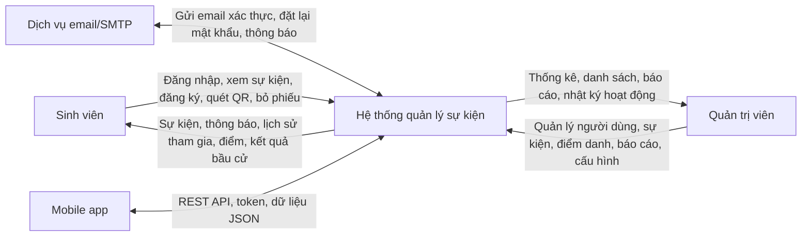
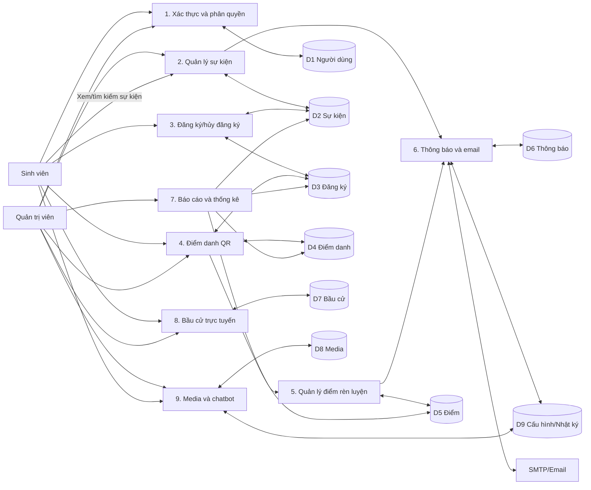
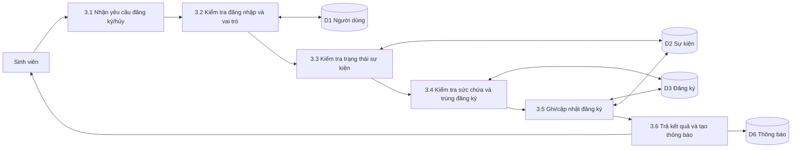
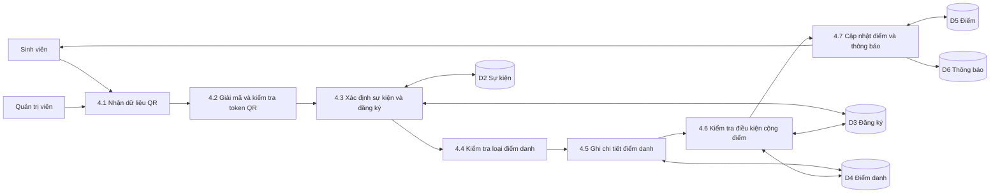

# Rà Soát Báo Cáo Đồ Án: Website Quản Lý Sự Kiện Khoa CNTT

Ngày rà soát: 02/06/2026  
File báo cáo được rà soát: `C:\Users\phuqu\OneDrive\Máy tính\64131942_DuongPhuQuang_DoAn.pdf`  
Tài liệu đối chiếu: `TAI_LIEU_TONG_QUAN_DU_AN.md`, `composer.json`, `package.json`, `mobile_app/package.json`, `routes/`, `tests/`, `database/migrations/`, `doc/`

Ghi chú về vị trí: cột "PDF p." là số trang vật lý trong file PDF. Từ Chương 1, số trang in trên báo cáo xấp xỉ bằng `PDF p. - 20`, ví dụ PDF p.105 tương ứng trang in 85.

## 1. Nhận Định Tổng Quan

Báo cáo có nền tảng nội dung tốt, mô tả được một hệ thống có phạm vi tương đối lớn: web Laravel, API mobile, React Native/Expo, QR điểm danh, điểm rèn luyện, bầu cử, media, báo cáo, SMTP, activity logs và chatbot. Điểm mạnh lớn nhất là báo cáo không dừng ở CRUD sự kiện mà đã thể hiện được nhiều nghiệp vụ thực tế.

Tuy nhiên, nếu đánh giá theo chuẩn báo cáo đồ án tốt nghiệp, bản hiện tại còn ba điểm yếu lớn cần sửa trước khi nộp: phần kiểm thử quá sơ sài, phần tài liệu tham khảo chưa được trích dẫn trong thân bài, và Chương 4 thiếu DFD để liên kết luồng nghiệp vụ với thiết kế dữ liệu. Ngoài ra, có lỗi không thống nhất công nghệ: báo cáo ghi Laravel 11 ở Lời mở đầu, trong khi `composer.json` của dự án dùng Laravel `^10.10`, PHP `^8.1`, Docker runtime là PHP 8.2.

Đánh giá hiện trạng: khá về khối lượng triển khai và phạm vi chức năng; chưa đạt về chuẩn học thuật ở kiểm thử, trích dẫn, tính cô đọng và nhất quán kỹ thuật.

## 2. Bảng Đánh Giá Theo Nhóm

| Nhóm đánh giá | Vị trí chính | Nhận xét | Mức độ | Hành động cải thiện |
| --- | --- | --- | --- | --- |
| Nội dung tổng quan | PDF p.20-22, Chương 1 | Nêu được bối cảnh và lý do chọn đề tài. Một số câu còn dài, có đoạn diễn đạt lặp ý về dữ liệu phân tán và khó thống kê. | Nên sửa | Gọn Chương 1 còn mục tiêu, phạm vi, đối tượng, đóng góp chính; chuyển vấn đề hiện trạng sang bảng. |
| Tính đúng với dự án | PDF p.20, p.40-46; `composer.json` | Báo cáo ghi Laravel 11/PHP 8.2, nhưng mã nguồn dùng Laravel `^10.10`, PHP `^8.1`; Docker dùng PHP 8.2. | Bắt buộc | Sửa thành: "Laravel 10, PHP 8.1 trở lên; môi trường Docker dùng PHP 8.2". |
| Nền tảng lý thuyết | PDF p.23-46, Chương 2 | Chương 2 bao quát nhiều khái niệm, nhưng nhiều đoạn định nghĩa chung như client-server, MVC, CSDL quan hệ, PHP, Node.js có mật độ chữ cao và chưa gắn trích dẫn. | Nên sửa | Rút ngắn định nghĩa phổ thông, giữ phần liên hệ trực tiếp với hệ thống; chèn trích dẫn `[1]`, `[3]`, `[4]`, `[7]`, `[9]`, `[10]`, `[11]`, `[12]`, `[14]`, `[15]`. |
| Khảo sát và yêu cầu | PDF p.47-56, Chương 3 | Có mô tả hiện trạng và nhóm chức năng. Tuy nhiên phần khó khăn, nhu cầu và yêu cầu còn dạng văn xuôi dài. | Nên sửa | Chuyển sang bảng: hiện trạng - vấn đề - yêu cầu hệ thống - module xử lý. |
| Phân tích thiết kế | PDF p.57-87, Chương 4 | Có use case, luồng nghiệp vụ, ERD, bảng dữ liệu, kiến trúc, giao diện, bảo mật. Thiếu DFD nên mối liên hệ giữa tác nhân, tiến trình và kho dữ liệu chưa rõ. | Bắt buộc | Bổ sung DFD ngữ cảnh, DFD mức 1 và DFD mức 2 cho đăng ký/điểm danh QR trước phần thiết kế CSDL. |
| Thiết kế CSDL | PDF p.64-80, mục 4.3 | Liệt kê bảng khá đầy đủ nhưng nặng văn bản/bảng, dễ làm người đọc mệt. | Nên sửa | Giữ ERD và bảng lõi trong thân bài; chuyển bảng ít trung tâm hoặc chi tiết cột dài sang phụ lục. |
| Xây dựng ứng dụng | PDF p.88-104, Chương 5 | Nhiều ảnh giao diện, giúp báo cáo trực quan. Nhưng mô tả module còn lặp lại chức năng ở Chương 3/4. | Có thể cải thiện | Với mỗi module, trình bày theo mẫu: mục tiêu, controller/service/model, giao diện, kết quả. |
| Kiểm thử | PDF p.105-106, mục 5.5 | Quá ngắn so với quy mô hệ thống; thiếu quy trình, môi trường, dữ liệu test, test case, kết quả, lỗi, tiêu chí pass/fail. | Bắt buộc | Tách thành Chương 6 riêng theo đề cương ở mục 10 của tài liệu này. |
| Tài liệu tham khảo | PDF p.112 | Danh mục có 15 nguồn nhưng thân bài gần như không có ký hiệu trích dẫn `[1]...[15]`. | Bắt buộc | Chèn trích dẫn tại các đoạn dùng khái niệm, công nghệ, CSDL, bảo mật, kiểm thử và triển khai. |
| Ngôn ngữ và trình bày | Toàn báo cáo; lỗi thấy rõ ở PDF p.20, p.33, p.39, p.45, p.55, p.105-106 | Có nhiều dấu hiệu tách chữ, thừa khoảng trắng trước dấu câu, bảng viết tắt trống, một số câu chưa mượt. | Nên sửa | Rà lại file Word gốc, bật kiểm tra chính tả, chuẩn hóa Unicode và cập nhật danh mục viết tắt. |

## 3. Điểm Mạnh

| Điểm mạnh | Vị trí | Căn cứ |
| --- | --- | --- |
| Phạm vi hệ thống rộng và có tính ứng dụng | PDF p.20, p.54-56, p.88-104 | Báo cáo nêu nhiều module: sự kiện, đăng ký, QR, điểm rèn luyện, thông báo, media, bầu cử, báo cáo, mobile app. |
| Có cả web và mobile | PDF p.44-45, p.102-104 | Mô tả React Native/Expo và giao diện mobile; đây là điểm cộng so với báo cáo chỉ có web. |
| Có tư duy kiến trúc | PDF p.81-82, mục 4.4 | Báo cáo trình bày kiến trúc tổng thể, backend Laravel, REST API, web/mobile và service layer. |
| Có thiết kế dữ liệu khá đầy đủ | PDF p.64-80, mục 4.3 | Các bảng chính như `nguoi_dung`, `su_kien`, `dang_ky`, `chi_tiet_diem_danh`, `lich_su_diem`, `thong_bao`, `bau_cu`, `thu_vien_da_phuong_tien` đã được mô tả. |
| Có nhiều minh họa giao diện | PDF p.88-104, Chương 5 | Danh mục hình cho thấy nhiều hình giao diện web/mobile, giúp giảm khô khan. |
| Mã nguồn có test tự động thật | `tests/Feature`, `tests/Unit` | Repo có test cho API auth, event, registration, QR, scanner, chatbot, admin, service đăng ký và service sự kiện. |

## 4. Điểm Yếu Và Kế Hoạch Cải Thiện

| Điểm yếu | Vị trí | Tác động | Mức độ | Cách sửa cụ thể |
| --- | --- | --- | --- | --- |
| Kiểm thử chỉ mô tả chung | PDF p.105-106 | Hội đồng khó đánh giá độ tin cậy của hệ thống; không thấy test case và kết quả cụ thể. | Bắt buộc | Tách thành Chương 6; thêm môi trường test, dữ liệu test, bảng test case, kết quả, lỗi, đánh giá. |
| Không có trích dẫn trong thân bài | Chương 2, 4, 5; danh mục ở p.112 | Làm giảm tính học thuật; tài liệu tham khảo giống danh sách trang trí. | Bắt buộc | Chèn ký hiệu `[n]` ngay sau câu/đoạn dùng nguồn; xem mục 7. |
| Chương 4 thiếu DFD | PDF p.57-87 | Thiếu cầu nối giữa yêu cầu nghiệp vụ và thiết kế CSDL; khó chứng minh bảng được thiết kế từ luồng dữ liệu. | Bắt buộc | Bổ sung DFD ở mục 4.2 hoặc trước 4.3; xem mục 9. |
| Bảng viết tắt trống | PDF p.19 | Thiếu chuyên nghiệp, trong khi báo cáo dùng rất nhiều thuật ngữ viết tắt. | Bắt buộc | Bổ sung bảng ở mục 6. |
| Không thống nhất phiên bản công nghệ | PDF p.20; `composer.json` | Sai sự thật so với mã nguồn, dễ bị hỏi khi bảo vệ. | Bắt buộc | Sửa Laravel 11 thành Laravel 10; ghi rõ Docker dùng PHP 8.2. |
| Chương 2 dài và nhiều lý thuyết phổ thông | PDF p.23-46 | Gây cảm giác "bội thực văn bản"; chiếm dung lượng nhưng chưa chứng minh đóng góp. | Nên sửa | Rút gọn định nghĩa, chuyển sang bảng công nghệ và lý do chọn; giữ phần liên hệ với hệ thống. |
| Nhiều lỗi tách chữ/định dạng | PDF p.20, p.33, p.39, p.45, p.55, p.105-106 | Làm báo cáo thiếu trau chuốt. | Nên sửa | Rà file Word gốc, chuẩn hóa font, bỏ khoảng trắng trước dấu câu, kiểm tra Unicode. |
| Chương 5 mô tả lại chức năng nhiều hơn kết quả hiện thực | PDF p.88-104 | Dễ trùng với Chương 3/4. | Có thể cải thiện | Thêm bảng module - controller/service - view/API - kết quả; giảm mô tả lặp. |

## 5. Rà Chính Tả, Lỗi Từ Và Lỗi Định Dạng Nghi Vấn

Lưu ý: một số lỗi dưới đây có thể phát sinh từ quá trình trích xuất PDF, không nhất thiết là lỗi hiển thị trong file Word. Khi áp dụng, cần kiểm tra lại trên file Word gốc.

| PDF p. | Mục | Cụm nghi lỗi | Loại lỗi | Đề xuất sửa |
| --- | --- | --- | --- | --- |
| 1 | Bìa | `Khánh Hoà` | Nên thống nhất chính tả địa danh | Dùng `Khánh Hòa` nếu toàn báo cáo theo chính tả phổ biến hiện nay. |
| 20 | Lời mở đầu | `giao di ện`, `cung c ấp`, `th ời gian thực`, `Sanctum ,` | Tách chữ/thừa khoảng trắng trước dấu câu | `giao diện`, `cung cấp`, `thời gian thực`, `Sanctum,`. |
| 20 | Lời mở đầu | `Laravel 11 (PHP 8.2)` | Sai/không khớp mã nguồn | `Laravel 10, PHP ^8.1; môi trường Docker dùng PHP 8.2`. |
| 21 | 1.1 | `khó khăn trong việc tổng hợp và thống kê báo cáo kém hiệu quả` | Diễn đạt lủng củng, lặp ý | `gây khó khăn trong việc tổng hợp số liệu, thống kê và lập báo cáo`. |
| 21 | 1.1 | `Hệ thống giúp quản lý dữ liệu sự kiện, đăng ký và thông báo, mà còn...` | Thiếu cặp quan hệ từ | `Hệ thống không chỉ giúp quản lý dữ liệu sự kiện, đăng ký và thông báo, mà còn...` hoặc `Hệ thống giúp..., đồng thời...`. |
| 23 | Chương 2 | `ÁP DỤNG` | Nghi lỗi Unicode/dấu tổ hợp | Chuẩn hóa thành `ÁP DỤNG`. |
| 26 | 2.2 | `NGHIỆP VỤ` | Nghi lỗi Unicode/dấu tổ hợp | Chuẩn hóa thành `NGHIỆP VỤ`. |
| 33 | 2.3.4 | `xác th ực token`, `route quan tr ọng` | Tách chữ | `xác thực token`, `route quan trọng`. |
| 39 | 2.5 | `quan tr ọng` | Tách chữ | `quan trọng`. |
| 40 | 2.6 | `mobile app ,`, `Blade k ết hợp`, `giao di ện`, `xác th ực API` | Tách chữ/thừa khoảng trắng | `mobile app,`, `Blade kết hợp`, `giao diện`, `xác thực API`. |
| 45 | 2.6.5-2.6.6 | `chi ti ết`, `công c ụ`, `PHP. Trong d ự án` | Tách chữ | `chi tiết`, `công cụ`, `PHP. Trong dự án`. |
| 46 | 2.6.7 | `framework ki ểm thử`, `tích h ợp` | Tách chữ | `framework kiểm thử`, `tích hợp`. |
| 55 | 3.4.2 | `tìm ki ếm người dùng` | Tách chữ | `tìm kiếm người dùng`. |
| 87 | 4.6 | `c ấu hình` | Tách chữ | `cấu hình`. |
| 88 | 5.1 | `Cấu hình` | Dấu không thống nhất | `Cấu hình`. |
| 89 | 5.1 | `hi ển thị` | Tách chữ | `hiển thị`. |
| 104 | 5.4.5 | `t ổng điểm` | Tách chữ | `tổng điểm`. |
| 105 | 5.5 | `mobile app .`, `API qu ản trị`, `quan tr ọng` | Thừa khoảng trắng/tách chữ | `mobile app.`, `API quản trị`, `quan trọng`. |
| 106 | 5.5-5.6 | `có c ấu hình`, `c ấu hình Docker`, `quan tr ọng` | Tách chữ | `có cấu hình`, `cấu hình Docker`, `quan trọng`. |

Các mẫu cần tìm/thay toàn báo cáo trong file Word:

| Tìm | Thay |
| --- | --- |
| `mobile app .` | `mobile app.` |
| `Sanctum ,` | `Sanctum,` |
| `c ấu` | `cấu` |
| `t ổng` | `tổng` |
| `quan tr ọng` | `quan trọng` |
| `tìm ki ếm` | `tìm kiếm` |
| `chi ti ết` | `chi tiết` |
| `công c ụ` | `công cụ` |
| `xác th ực` | `xác thực` |
| `giao di ện` | `giao diện` |
| `ÁP DỤNG` | `ÁP DỤNG` |
| `MỤC TIÊU` | `MỤC TIÊU` |
| `NGHIỆP VỤ` | `NGHIỆP VỤ` |

## 6. Bảng Viết Tắt Cần Bổ Sung

Trang PDF p.19 hiện chỉ có tiêu đề "DANH MỤC CÁC KÝ HIỆU, TỪ VIẾT TẮT" nhưng chưa có nội dung trích xuất được. Nên bổ sung bảng sau:

| Từ viết tắt | Tiếng Anh/thuật ngữ đầy đủ | Giải thích trong báo cáo |
| --- | --- | --- |
| API | Application Programming Interface | Giao diện lập trình ứng dụng, dùng cho mobile app và các request dữ liệu. |
| QR | Quick Response | Mã QR dùng cho điểm danh sự kiện và QR cá nhân sinh viên. |
| MVC | Model - View - Controller | Mô hình tổ chức ứng dụng Laravel. |
| ORM | Object Relational Mapping | Cơ chế ánh xạ model với bảng dữ liệu, trong dự án dùng Eloquent ORM. |
| REST | Representational State Transfer | Phong cách thiết kế API cho web/mobile. |
| HTTP | HyperText Transfer Protocol | Giao thức request/response giữa client và server. |
| JSON | JavaScript Object Notation | Định dạng dữ liệu API trả về cho mobile app. |
| SMTP | Simple Mail Transfer Protocol | Giao thức gửi email xác thực, đặt lại mật khẩu và thông báo. |
| CSRF | Cross-Site Request Forgery | Kiểu tấn công giả mạo request; Laravel có middleware chống CSRF. |
| XSS | Cross-Site Scripting | Kiểu tấn công chèn mã độc vào nội dung hiển thị. |
| UI/UX | User Interface/User Experience | Giao diện người dùng và trải nghiệm người dùng. |
| PHP | PHP: Hypertext Preprocessor | Ngôn ngữ lập trình backend của hệ thống. |
| SQL | Structured Query Language | Ngôn ngữ truy vấn cơ sở dữ liệu quan hệ. |
| CSDL | Cơ sở dữ liệu | Nơi lưu trữ dữ liệu nghiệp vụ của hệ thống. |
| CNTT | Công nghệ thông tin | Khoa Công nghệ Thông tin. |
| GVHD | Giảng viên hướng dẫn | Người hướng dẫn đồ án. |
| MSSV | Mã số sinh viên | Mã định danh sinh viên, đồng thời là khóa chính của bảng `nguoi_dung`. |

Nguyên tắc dùng: lần đầu xuất hiện trong thân bài nên viết đầy đủ, ví dụ "Application Programming Interface (API)", sau đó mới dùng viết tắt.

## 7. Đối Chiếu Tài Liệu Tham Khảo Và Vị Trí Cần Chèn Trích Dẫn

Kết quả rà soát: trong thân bài trước trang tài liệu tham khảo chưa thấy ký hiệu trích dẫn dạng `[1]...[15]`. Vì vậy cần chèn trích dẫn trực tiếp sau các câu/ý có nguồn.

| Nguồn | Ý/câu trong báo cáo đang dùng nội dung tương ứng | Vị trí nên chèn | Đề xuất |
| --- | --- | --- | --- |
| `[1]` Giáo trình Cơ sở dữ liệu | Các đoạn về CSDL quan hệ, khóa chính, khóa ngoại, toàn vẹn dữ liệu. | PDF p.33-35; p.64-80 | Chèn sau đoạn định nghĩa CSDL quan hệ và đoạn mô tả khóa/ràng buộc. |
| `[2]` Pressman, Kỹ nghệ phần mềm | Các đoạn về xác định yêu cầu, quy trình phát triển, kiểm thử chức năng. | PDF p.49-56; Chương 6 mới | Dùng cho phần yêu cầu hệ thống và quy trình kiểm thử. |
| `[3]` Database System Concepts | Các đoạn về thiết kế quan hệ, chuẩn hóa dữ liệu, transaction, index. | PDF p.34-36; p.64-80 | Chèn sau đoạn nói MySQL hỗ trợ truy vấn, ràng buộc, giao tác, tối ưu chỉ mục. |
| `[4]` Laravel Documentation | Các đoạn về Laravel, route, middleware, controller, validation, service layer. | PDF p.32-33; p.40-41; p.88-89 | Chèn ở phần 2.3.4, 2.6.1 và 5.1-5.2. |
| `[5]` Laravel Sanctum | Các đoạn về token API cho mobile app. | PDF p.43-44; p.86; p.105-106 | Chèn sau câu "Sanctum được sử dụng để hỗ trợ xác thực cho ứng dụng mobile". |
| `[6]` Laravel Broadcasting | Báo cáo có nhắc Broadcasting/Pusher hoặc Redis ở Lời mở đầu. | PDF p.20 | Nếu hệ thống chưa triển khai realtime broadcasting thật, nên bỏ nguồn này hoặc chuyển thành hướng mở rộng. |
| `[7]` PHP Documentation | Các đoạn giới thiệu PHP. | PDF p.40 | Chèn sau đoạn định nghĩa PHP là ngôn ngữ phía server. |
| `[8]` Composer Documentation | Đoạn giới thiệu Composer. | PDF p.45 | Chèn sau câu "Composer là công cụ quản lý thư viện phụ thuộc dành cho PHP". |
| `[9]` Node.js Documentation | Đoạn giới thiệu Node.js/npm. | PDF p.45 | Chèn sau đoạn Node.js phục vụ công cụ frontend. |
| `[10]` Vite Guide | Đoạn về Vite build CSS/JS và production assets. | PDF p.42-43; p.106 | Chèn ở mục Blade/Vite/Tailwind và mục build frontend. |
| `[11]` Tailwind CSS Documentation | Đoạn về Tailwind utility-first. | PDF p.42-43 | Chèn sau câu giải thích Tailwind CSS. |
| `[12]` MySQL 8.0 Reference Manual | Đoạn về MySQL, dữ liệu quan hệ, query, index. | PDF p.34; p.40-41; p.106 | Chèn sau đoạn giới thiệu MySQL và đoạn triển khai MySQL 8 trong Docker Compose. |
| `[13]` Redis Documentation | Báo cáo nhắc Redis ở triển khai Docker/cache/queue. | PDF p.46; p.106-107 | Nếu Redis chỉ là service tùy chọn, ghi rõ "Redis có thể dùng cho cache/queue" và chèn nguồn tại đó. |
| `[14]` PHPUnit Documentation | Đoạn về PHPUnit và kiểm thử tự động. | PDF p.46; Chương 6 mới | Chèn sau đoạn giới thiệu PHPUnit; dùng lại trong mục công cụ kiểm thử. |
| `[15]` Docker Compose Documentation | Đoạn về Docker Compose gồm app, db, nginx, redis. | PDF p.45-46; p.106 | Chèn sau đoạn giải thích Docker Compose đóng gói môi trường. |

Các nguồn chưa dùng rõ ràng: `[6]` Broadcasting và `[13]` Redis cần được đối chiếu lại với mã nguồn. Nếu báo cáo không trình bày rõ chức năng realtime/cache/queue, nên bỏ khỏi danh mục tham khảo hoặc chuyển thành "hướng phát triển".

## 8. Phần Nên Lược Bỏ, Chuyển Bảng Hoặc Chèn Sơ Đồ

| Vị trí | Hiện trạng | Vấn đề | Đề xuất xử lý |
| --- | --- | --- | --- |
| PDF p.23-29, mục 2.1-2.2 | Nhiều đoạn mô tả quản lý sự kiện và nghiệp vụ chính bằng văn xuôi. | Dài, dễ trùng với Chương 3. | Giữ 2-3 đoạn tổng quan; chuyển nghiệp vụ chính thành bảng "nghiệp vụ - dữ liệu vào - dữ liệu ra - module xử lý". |
| PDF p.29-33, mục 2.3 | Giải thích client-server, MVC, REST, Laravel phân lớp. | Kiến thức phổ thông, nhiều chữ. | Rút gọn; thêm một sơ đồ kiến trúc nhỏ thay cho nhiều đoạn. |
| PDF p.33-36, mục 2.4 | CSDL quan hệ, khóa, index, tìm kiếm, phân trang. | Có ích nhưng dài. | Chuyển thành bảng nguyên tắc thiết kế CSDL và liên hệ trực tiếp với bảng trong hệ thống. |
| PDF p.40-46, mục 2.6 | Mỗi công nghệ được mô tả bằng đoạn văn dài. | Dễ thành danh sách lý thuyết công nghệ. | Chuyển sang bảng "công nghệ - vai trò trong dự án - nguồn tham khảo". |
| PDF p.47-56, Chương 3 | Hiện trạng, khó khăn, nhu cầu, yêu cầu chức năng. | Nhiều trang không có sơ đồ/bảng đủ cô đọng. | Thêm bảng khảo sát và bảng yêu cầu; giữ văn xuôi ngắn ở đầu chương. |
| PDF p.64-80, mục 4.3 | Nhiều bảng dữ liệu liên tiếp. | Người đọc dễ bị ngợp. | Giữ bảng lõi trong thân bài; chuyển chi tiết bảng ít trung tâm sang phụ lục. |
| PDF p.57-87, Chương 4 | Có use case, sequence, ERD nhưng chưa có DFD. | Chưa chứng minh luồng dữ liệu dẫn đến bảng dữ liệu. | Thêm DFD ngữ cảnh, DFD mức 1, DFD mức 2 trước phần thiết kế CSDL. |
| PDF p.105-106, mục 5.5 | Kiểm thử bằng văn xuôi ngắn. | Không đủ chuẩn quy trình kiểm thử. | Tách thành Chương 6 mới, dùng đề cương và test matrix ở mục 10. |

## 9. DFD Đề Xuất Cho Chương 4

### 9.1 Vị trí chèn trong báo cáo

Nên thêm mục mới sau phần use case/luồng nghiệp vụ và trước thiết kế CSDL:

```text
4.3 Thiết kế luồng dữ liệu DFD
4.3.1 DFD mức ngữ cảnh
4.3.2 DFD mức 1 của hệ thống
4.3.3 DFD mức 2 cho đăng ký sự kiện
4.3.4 DFD mức 2 cho điểm danh QR
4.4 Thiết kế cơ sở dữ liệu
```

Sau khi thêm mục này, cần đánh số lại các mục sau trong Chương 4.

### 9.2 Quy ước kho dữ liệu

| Mã | Kho dữ liệu | Bảng tương ứng |
| --- | --- | --- |
| D1 | Người dùng | `nguoi_dung`, `personal_access_tokens`, `password_reset_tokens` |
| D2 | Sự kiện và loại sự kiện | `su_kien`, `loai_su_kien`, `mau_bai_dang` |
| D3 | Đăng ký tham gia | `dang_ky` |
| D4 | Điểm danh | `chi_tiet_diem_danh` |
| D5 | Điểm rèn luyện | `lich_su_diem` |
| D6 | Thông báo | `thong_bao`, `lich_gui_thong_bao`, `smtp_settings` |
| D7 | Bầu cử | `bau_cu`, `ung_cu_vien`, `cu_tri`, `phieu_bau`, `chi_tiet_phieu_bau` |
| D8 | Media | `thu_vien_da_phuong_tien`, `the_anh`, `the_anh_thu_vien` |
| D9 | Cấu hình và nhật ký | `activity_logs`, `gemini_settings`, `smtp_settings` |

### 9.3 DFD mức ngữ cảnh



Nội dung thuyết minh cần viết kèm: DFD mức ngữ cảnh cho thấy hệ thống là trung tâm xử lý yêu cầu từ sinh viên, quản trị viên và mobile app. Các dữ liệu phát sinh được lưu trong CSDL nội bộ; email/SMTP là hệ thống ngoài phục vụ xác thực và thông báo.

### 9.4 DFD mức 1



### 9.5 DFD mức 2: Đăng ký và hủy đăng ký sự kiện



Luồng này giải thích vì sao cần bảng `dang_ky` lưu trạng thái đăng ký, bảng `su_kien` lưu sức chứa/trạng thái, và bảng `thong_bao` để phản hồi kết quả cho người dùng.

### 9.6 DFD mức 2: Điểm danh QR



Luồng này làm rõ ràng buộc thiết kế: một đăng ký có nhiều bản ghi điểm danh theo loại `dau_buoi`/`cuoi_buoi`, khi đủ điều kiện thì mới ghi `lich_su_diem` và cập nhật trạng thái tham gia.

## 10. Đề Cương Chương 6 Kiểm Thử Đề Xuất

### 10.1 Cấu trúc chương

```text
Chương 6. KIỂM THỬ HỆ THỐNG WEB VÀ MOBILE APP
6.1 Mục tiêu kiểm thử
6.2 Phạm vi kiểm thử
6.3 Môi trường và công cụ kiểm thử
6.4 Dữ liệu kiểm thử
6.5 Chiến lược kiểm thử
6.6 Ma trận test case
6.7 Kết quả kiểm thử theo nhóm chức năng
6.8 Lỗi phát hiện và hướng xử lý
6.9 Đánh giá sau kiểm thử
```

Sau khi thêm Chương 6, Chương 6 hiện tại trong PDF cần đổi thành `Chương 7. Kết luận và hướng phát triển`.

### 10.2 Nội dung có thể viết trực tiếp vào báo cáo

**6.1 Mục tiêu kiểm thử**

Kiểm thử được thực hiện nhằm xác nhận hệ thống quản lý sự kiện đáp ứng các yêu cầu chức năng và phi chức năng đã xác định ở Chương 3, đồng thời kiểm tra sự phù hợp giữa thiết kế ở Chương 4 và phần hiện thực ở Chương 5. Trọng tâm kiểm thử gồm xác thực, phân quyền, quản lý sự kiện, đăng ký/hủy đăng ký, điểm danh QR, cộng điểm rèn luyện, thông báo, media, bầu cử, báo cáo, API mobile và khả năng hiển thị trên web/mobile.

**6.2 Phạm vi kiểm thử**

Phạm vi kiểm thử bao gồm giao diện web cho sinh viên, giao diện quản trị, REST API phục vụ mobile app, ứng dụng mobile React Native/Expo và các service nghiệp vụ trong backend Laravel. Các chức năng ngoài phạm vi kiểm thử sâu gồm kiểm thử tải lớn trên môi trường production, kiểm thử xâm nhập chuyên sâu và kiểm thử trên toàn bộ thiết bị mobile thực tế.

**6.3 Môi trường và công cụ kiểm thử**

| Thành phần | Môi trường/công cụ đề xuất |
| --- | --- |
| Backend | Laravel 10, PHP `^8.1`, Docker runtime PHP 8.2 |
| CSDL | MySQL 8 hoặc database test tương đương |
| Web frontend | Blade, Vite 5, trình duyệt Chrome/Edge |
| Mobile | React Native 0.83.6, Expo 55, thiết bị/emulator Android |
| API | Laravel Sanctum, request trực tiếp bằng Postman/HTTP client hoặc test Feature |
| Tự động hóa test | PHPUnit 10, Laravel Feature Test, Unit Test |
| Kiểm tra build | `npm run build`, `php artisan test` |

**6.4 Dữ liệu kiểm thử**

| Nhóm dữ liệu | Dữ liệu cần có |
| --- | --- |
| Người dùng | 1 admin hoạt động, 2 sinh viên đã xác thực email, 1 sinh viên chưa xác thực, 1 tài khoản bị khóa |
| Sự kiện | Sự kiện sắp diễn ra còn chỗ, sự kiện đã đầy, sự kiện đã bắt đầu, sự kiện đã kết thúc, sự kiện bị hủy |
| Đăng ký | Đăng ký hợp lệ, đăng ký trùng, đăng ký đã hủy, đăng ký đã điểm danh một lần, đăng ký đủ hai lần điểm danh |
| QR | QR đầu buổi hợp lệ, QR cuối buổi hợp lệ, QR hết hạn, QR sai định dạng, QR cá nhân sinh viên |
| Bầu cử | Cuộc bầu cử đang diễn ra, đã kết thúc, có cử tri hợp lệ, sinh viên không thuộc danh sách cử tri |
| Media | Ảnh hợp lệ, file sai định dạng, file vượt dung lượng, media gắn với sự kiện |
| Báo cáo | Lớp có dữ liệu điểm, lớp không có dữ liệu, khoảng thời gian hợp lệ/không hợp lệ |

**6.5 Chiến lược kiểm thử**

| Loại kiểm thử | Mục tiêu |
| --- | --- |
| Kiểm thử đơn vị | Kiểm tra service xử lý nghiệp vụ như đăng ký, hủy đăng ký, điểm danh, thống kê sự kiện. |
| Kiểm thử chức năng | Kiểm tra từng chức năng trên web và mobile theo yêu cầu. |
| Kiểm thử API | Kiểm tra status code, JSON response, validation, token và phân quyền. |
| Kiểm thử tích hợp | Kiểm tra luồng liên kết nhiều module: đăng ký -> điểm danh -> cộng điểm -> thông báo. |
| Kiểm thử bảo mật cơ bản | Kiểm tra đăng nhập, token, vai trò, CSRF, validation và giới hạn upload. |
| Kiểm thử giao diện | Kiểm tra hiển thị tiếng Việt, layout responsive, vùng an toàn mobile, lỗi ảnh/storage. |
| Kiểm thử hồi quy | Chạy lại các test sau khi sửa lỗi để bảo đảm chức năng cũ không bị ảnh hưởng. |

### 10.3 Ma trận test case đề xuất

| ID | Nhóm | Kịch bản | Dữ liệu/điều kiện | Kết quả mong đợi |
| --- | --- | --- | --- | --- |
| TC-01 | Xác thực web | Admin đăng nhập đúng thông tin | Email/mật khẩu admin hợp lệ | Vào được trang quản trị. |
| TC-02 | Xác thực web | Sinh viên đăng nhập đúng thông tin | Tài khoản sinh viên đã xác thực | Vào được trang chủ sinh viên. |
| TC-03 | Xác thực web | Đăng nhập sai mật khẩu | Email đúng, mật khẩu sai | Hệ thống báo lỗi, không tạo session. |
| TC-04 | Xác thực API | Sinh viên đã xác thực đăng nhập mobile | Email/mật khẩu hợp lệ | API trả token Sanctum và thông tin user. |
| TC-05 | Xác thực API | Sinh viên chưa xác thực email đăng nhập API | Tài khoản chưa xác thực | API từ chối đăng nhập hoặc yêu cầu xác thực. |
| TC-06 | Phân quyền | Sinh viên truy cập route admin | Session sinh viên | Bị chuyển hướng/từ chối truy cập. |
| TC-07 | Phân quyền API | Sinh viên gọi API admin | Token sinh viên | API trả 403. |
| TC-08 | Quản lý người dùng | Admin tạo sinh viên mới | Dữ liệu hợp lệ, avatar hợp lệ | Tạo user thành công, gửi email xác thực nếu SMTP sẵn sàng. |
| TC-09 | Quản lý người dùng | Admin lọc người dùng theo lớp | Lớp có dữ liệu | Danh sách chỉ hiển thị sinh viên thuộc lớp đã chọn. |
| TC-10 | Quản lý sự kiện | Admin tạo sự kiện hợp lệ | Tên, thời gian, địa điểm, số lượng hợp lệ | Sự kiện được lưu, hiển thị ở danh sách. |
| TC-11 | Quản lý sự kiện | Tạo sự kiện trùng lịch/địa điểm | Trùng thời gian và địa điểm | Hệ thống cảnh báo hoặc từ chối theo rule. |
| TC-12 | Quản lý sự kiện | Admin cập nhật sự kiện | Sự kiện tồn tại | Dữ liệu được cập nhật đúng. |
| TC-13 | Quản lý sự kiện | Admin xóa sự kiện | Sự kiện tồn tại | Sự kiện bị xóa mềm hoặc không còn hiển thị. |
| TC-14 | Sự kiện API | Mobile lấy danh sách sự kiện | Không cần token hoặc có token | API trả danh sách JSON đúng cấu trúc. |
| TC-15 | Sự kiện API | Tìm kiếm sự kiện | Từ khóa có kết quả | API trả sự kiện phù hợp từ khóa. |
| TC-16 | Đăng ký | Sinh viên đăng ký sự kiện còn chỗ | Sự kiện sắp diễn ra, chưa đăng ký | Tạo bản ghi `dang_ky`, tăng số lượng hiện tại. |
| TC-17 | Đăng ký | Đăng ký trùng | Sinh viên đã đăng ký sự kiện | Hệ thống từ chối đăng ký trùng. |
| TC-18 | Đăng ký | Đăng ký sự kiện đã đầy | `so_luong_hien_tai` bằng `so_luong_toi_da` | Hệ thống từ chối và thông báo hết chỗ. |
| TC-19 | Đăng ký | Đăng ký sự kiện đã bắt đầu | Thời gian hiện tại sau giờ bắt đầu | Hệ thống từ chối đăng ký. |
| TC-20 | Hủy đăng ký | Hủy trước giờ diễn ra | Đã đăng ký, sự kiện chưa bắt đầu | Bản ghi bị hủy/xóa mềm, giảm số lượng hiện tại. |
| TC-21 | Hủy đăng ký | Hủy sau khi sự kiện bắt đầu | Sự kiện đang diễn ra | Hệ thống từ chối hủy. |
| TC-22 | QR | Quét QR đầu buổi hợp lệ | Đã đăng ký, QR hợp lệ | Ghi `chi_tiet_diem_danh` loại `dau_buoi`. |
| TC-23 | QR | Quét QR cuối buổi hợp lệ | Đã có đầu buổi, QR cuối buổi hợp lệ | Ghi `cuoi_buoi`, cập nhật đủ điều kiện. |
| TC-24 | QR | Quét trùng cùng loại | Đã có bản ghi `dau_buoi` | Hệ thống từ chối hoặc báo đã điểm danh. |
| TC-25 | QR | Quét QR sai/hết hạn | Payload sai hoặc quá hạn | Hệ thống từ chối, không ghi điểm danh. |
| TC-26 | QR | Sinh viên chưa đăng ký quét QR | Sự kiện còn chỗ, chính sách cho phép | Hệ thống tạo đăng ký hoặc từ chối theo rule đã thiết kế. |
| TC-27 | Điểm | Đủ điều kiện cộng điểm | Có đủ số lần điểm danh yêu cầu | Tạo `lich_su_diem` đúng số điểm, không cộng lặp. |
| TC-28 | Điểm | Admin cộng/trừ điểm thủ công | Admin hợp lệ, dữ liệu điểm hợp lệ | Ghi lịch sử điểm đúng nguồn. |
| TC-29 | Thông báo | Sinh viên xem thông báo | Có thông báo chưa đọc | Danh sách hiển thị, badge đúng số chưa đọc. |
| TC-30 | Thông báo | Đánh dấu đã đọc | Thông báo tồn tại | `da_doc` được cập nhật. |
| TC-31 | Media | Upload ảnh hợp lệ | File ảnh đúng định dạng/dung lượng | File lưu đúng storage, hiển thị trong thư viện. |
| TC-32 | Media | Upload file sai định dạng | File không được phép | Hệ thống từ chối và báo lỗi validation. |
| TC-33 | Bầu cử | Cử tri hợp lệ bỏ phiếu | Cuộc bầu cử đang diễn ra, sinh viên thuộc `cu_tri` | Tạo phiếu bầu, đánh dấu đã bỏ phiếu. |
| TC-34 | Bầu cử | Sinh viên không phải cử tri bỏ phiếu | Không có trong `cu_tri` | Hệ thống từ chối bỏ phiếu. |
| TC-35 | Báo cáo | Xuất báo cáo lớp có dữ liệu | Lớp và khoảng ngày hợp lệ | Xuất file Excel đúng dữ liệu. |
| TC-36 | Báo cáo | Xuất báo cáo không có dữ liệu | Lớp/khoảng ngày không có bản ghi | Hệ thống báo không có dữ liệu, không xuất file rỗng vô nghĩa. |
| TC-37 | Giao diện | Kiểm tra responsive web | Desktop và mobile viewport | Không vỡ layout, chữ không chồng lấn. |
| TC-38 | Mobile | Kiểm tra vùng an toàn và font tiếng Việt | Thiết bị/emulator Android | Không mất nội dung ở notch/status bar, tiếng Việt hiển thị đúng. |
| TC-39 | Bảo mật | CSRF trên form web | Request POST không có token CSRF | Request bị từ chối. |
| TC-40 | Hồi quy | Chạy lại test tự động sau sửa lỗi | `php artisan test` | Toàn bộ test quan trọng pass. |

### 10.4 Test tự động hiện có trong mã nguồn

Các test hiện có nên được nhắc trong Chương 6 để tăng độ tin cậy:

| Nhóm test | File tiêu biểu | Nội dung |
| --- | --- | --- |
| API xác thực | `tests/Feature/Api/AuthApiTest.php` | Đăng nhập mobile, tài khoản chưa xác thực, đăng ký mobile, gửi lại email xác thực. |
| API sự kiện | `tests/Feature/Api/EventApiTest.php` | Danh sách, chi tiết, tìm kiếm, tạo/sửa/xóa sự kiện. |
| API đăng ký | `tests/Feature/Api/RegistrationApiTest.php` | Đăng ký, chống đăng ký trùng, hủy, lịch sử, admin scan QR. |
| QR | `tests/Feature/Api/QrCodeApiTest.php`, `tests/Feature/CheckinScannerTest.php` | Tạo QR SVG/PNG, scanner, QR hết hạn, QR cá nhân sinh viên. |
| Service đăng ký | `tests/Unit/Services/RegistrationServiceTest.php` | Đăng ký, hủy, cập nhật trạng thái, điểm danh đủ điều kiện, cộng điểm một lần. |
| Service sự kiện | `tests/Unit/Services/EventServiceTest.php` | Sự kiện sắp diễn ra, tạo/sửa, kiểm tra trùng lịch, thống kê. |
| Admin | `tests/Feature/Admin/*` | Activity logs, báo cáo, cấu hình Gemini, quản lý người dùng. |
| Chatbot | `tests/Feature/Chatbot/GeminiChatbotTest.php` | Fallback nội bộ, lịch sử đăng ký, cache, gọi Gemini khi cấu hình. |

### 10.5 Bảng lỗi phát hiện nên đưa vào Chương 6

Phần 5.5 hiện có nhắc lỗi nhưng chưa trình bày thành bảng. Nên chuyển thành:

| Mã lỗi | Nhóm | Mô tả | Hướng xử lý | Trạng thái |
| --- | --- | --- | --- | --- |
| BUG-01 | Storage | Ảnh upload không hiển thị do đường dẫn storage/link public. | Kiểm tra `php artisan storage:link`, chuẩn hóa đường dẫn lưu file. | Đã khắc phục |
| BUG-02 | Mobile API | Mobile app không kết nối đúng backend do sai base URL/IP. | Cấu hình `EXPO_PUBLIC_API_URL` đúng IP máy chạy Laravel. | Đã khắc phục |
| BUG-03 | Giao diện | Font tiếng Việt hiển thị chưa ổn định ở một số màn hình. | Chuẩn hóa font và kiểm tra render trên web/mobile. | Đã khắc phục |
| BUG-04 | Mobile UI | Một số nội dung bị sát vùng status bar/notch. | Dùng `SafeAreaView`/safe area context. | Đã khắc phục |
| BUG-05 | Upload avatar | Upload avatar lỗi validation/đường dẫn. | Rà rule upload, storage path và hiển thị ảnh. | Đã khắc phục |

### 10.6 Tiêu chí kết thúc kiểm thử

| Tiêu chí | Mức đạt đề xuất |
| --- | --- |
| Chức năng cốt lõi | 100% test case đăng nhập, sự kiện, đăng ký, QR, điểm, phân quyền pass. |
| API mobile | Các API chính trả đúng status code, JSON và lỗi validation. |
| Bảo mật cơ bản | Không truy cập được route/API admin bằng tài khoản sinh viên; form web có CSRF; API cần token khi bắt buộc. |
| Dữ liệu | Không cộng điểm lặp, không đăng ký trùng, không vượt sức chứa sự kiện. |
| Giao diện | Không lỗi font tiếng Việt, không vỡ layout ở màn hình kiểm thử chính. |
| Hồi quy | Các test tự động quan trọng chạy pass sau khi sửa lỗi. |

## 11. Đề Xuất Chỉnh Cấu Trúc Báo Cáo

| Cấu trúc hiện tại | Cấu trúc đề xuất |
| --- | --- |
| Chương 5. Xây dựng ứng dụng, gồm cả `5.5 Kiểm thử hệ thống` | Chương 5 chỉ giữ xây dựng ứng dụng và triển khai. Mục 5.5 đổi thành đoạn dẫn: "Nội dung kiểm thử được trình bày riêng ở Chương 6". |
| Chương 6. Kết luận | Chương 7. Kết luận và hướng phát triển |
| Tài liệu tham khảo | Giữ cuối báo cáo, sau Chương 7 |
| Danh mục viết tắt trống | Bổ sung bảng viết tắt trước Lời mở đầu |
| Chương 4 chưa có DFD | Thêm mục DFD trước thiết kế CSDL |

Đoạn thay thế ngắn cho mục 5.5 hiện tại:

```text
5.5 Tổng quan kiểm thử

Sau khi hoàn thành các module chính, hệ thống được kiểm thử trên cả giao diện web, REST API và ứng dụng mobile. Nội dung kiểm thử tập trung vào các nghiệp vụ cốt lõi như xác thực, phân quyền, quản lý sự kiện, đăng ký/hủy đăng ký, điểm danh QR, cộng điểm rèn luyện, thông báo, bầu cử và báo cáo. Quy trình kiểm thử, dữ liệu kiểm thử, test case và kết quả chi tiết được trình bày trong Chương 6.
```

## 12. Danh Sách Việc Cần Làm Theo Ưu Tiên

### Bắt buộc sửa

1. Sửa sai phiên bản công nghệ: Laravel 11 -> Laravel 10; PHP 8.2 cần ghi là runtime Docker, không phải constraint duy nhất của dự án.
2. Thêm trích dẫn `[1]...[15]` trong thân bài.
3. Bổ sung bảng viết tắt ở PDF p.19.
4. Tách kiểm thử thành Chương 6 đầy đủ.
5. Thêm DFD trong Chương 4 và liên hệ DFD với các bảng dữ liệu.

### Nên sửa

1. Rút gọn Chương 2, giảm lý thuyết phổ thông.
2. Chuyển phần hiện trạng/yêu cầu ở Chương 3 thành bảng.
3. Chuyển một phần chi tiết bảng CSDL dài sang phụ lục.
4. Rà toàn bộ lỗi tách chữ, thừa khoảng trắng và dấu câu.
5. Bổ sung bảng "module - controller/service - model - view/API - test" ở Chương 5.

### Có thể cải thiện

1. Thêm phụ lục test case đầy đủ nếu Chương 6 quá dài.
2. Thêm phụ lục danh sách route/API chính.
3. Thêm phụ lục ảnh giao diện nếu số lượng ảnh làm gián đoạn mạch đọc.

## 13. Kết Luận Rà Soát

Báo cáo có nền tảng triển khai tốt và phạm vi hệ thống đủ mạnh cho một đồ án tốt nghiệp. Các phần cần sửa không phải là thiếu sản phẩm, mà là thiếu cách chứng minh sản phẩm theo chuẩn báo cáo: trích dẫn nguồn, DFD, kiểm thử có quy trình và trình bày cô đọng. Nếu thực hiện các chỉnh sửa bắt buộc trong tài liệu này, báo cáo sẽ thuyết phục hơn rõ rệt khi đọc và khi bảo vệ.
