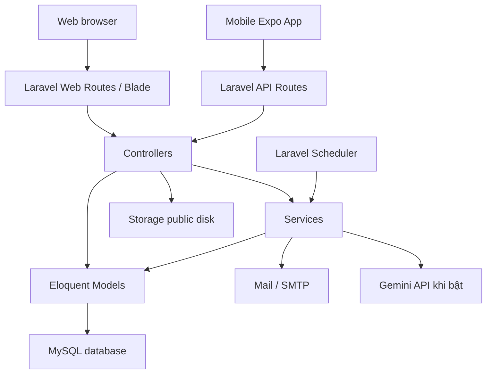
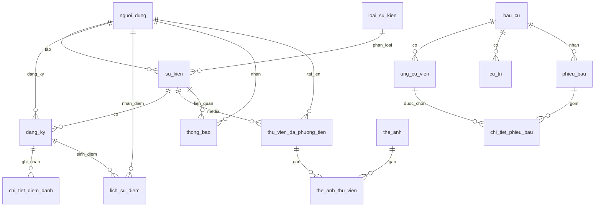

# Tài liệu tổng quan dự án QL Sự Kiện

Ngày lập tài liệu: 19/05/2026  
Thư mục dự án: `D:\laragon\www\ql_su_kien`

## 1. Tóm tắt nhanh

`ql_su_kien` là hệ thống quản lý sự kiện dành cho môi trường khoa/trường, tập trung vào các nghiệp vụ:

- Quản lý tài khoản sinh viên và quản trị viên.
- Quản lý loại sự kiện, bài đăng sự kiện, mẫu bài đăng và thư viện media.
- Cho sinh viên xem, tìm kiếm, đăng ký và hủy đăng ký sự kiện.
- Điểm danh bằng QR, có phân biệt điểm danh đầu buổi và cuối buổi.
- Cộng/trừ điểm rèn luyện, xem lịch sử điểm và bảng xếp hạng.
- Gửi thông báo trong hệ thống và email xác thực/đặt lại mật khẩu.
- Quản lý bầu cử trực tuyến với cử tri, ứng cử viên, phiếu bầu và kết quả.
- Xuất báo cáo điểm theo lớp ra Excel.
- Chatbot hỗ trợ hỏi đáp sự kiện, dùng dữ liệu nội bộ và có thể gọi Gemini khi được cấu hình.
- Ứng dụng mobile React Native/Expo dùng API Laravel để xem sự kiện, điểm danh QR, bầu cử, thông báo, điểm và hồ sơ.

Dự án gồm hai phần chính:

- Web backend/frontend: Laravel Blade + API REST.
- Mobile app: React Native/Expo trong thư mục `mobile_app/`.

## 2. Công nghệ sử dụng

### Backend web

| Thành phần | Công nghệ | Ghi chú |
| --- | --- | --- |
| Ngôn ngữ | PHP `^8.1` | Dockerfile dùng `php:8.2-fpm`. |
| Framework | Laravel `^10.10` | Cấu trúc Laravel truyền thống: routes, controllers, models, services, migrations. |
| Authentication web | Laravel session guard | Guard mặc định là `web`. |
| Authentication API | Laravel Sanctum `^3.3` | Token lưu ở bảng `personal_access_tokens`. |
| ORM | Eloquent | Model dùng khóa chính tiếng Việt như `ma_sinh_vien`, `ma_su_kien`. |
| Database | MySQL | Cấu hình mặc định lấy từ `.env`; SQL dump là `ql_su_kien.sql`. |
| QR | `simplesoftwareio/simple-qrcode` | Tạo QR check-in SVG/PNG. |
| Excel | `maatwebsite/excel` | Import danh sách, export báo cáo lớp. |
| HTTP client | Guzzle | Dùng cho tích hợp Gemini/chatbot. |
| Test | PHPUnit 10 | Có Unit và Feature tests trong `tests/`. |

### Frontend web

| Thành phần | Công nghệ | Ghi chú |
| --- | --- | --- |
| Template | Blade | Views nằm trong `resources/views`. |
| Build tool | Vite 5 | Entry: `resources/css/app.css`, `resources/js/app.js`. |
| CSS | Tailwind config hiện diện | `tailwind.config.js` có màu primary/secondary, font Inter/Montserrat, plugin forms/typography. |
| JavaScript | Axios, Chart.js | Axios dùng cho request động, Chart.js cho thống kê. |

### Mobile

| Thành phần | Công nghệ | Ghi chú |
| --- | --- | --- |
| Framework | React Native `0.83.6` | Chạy qua Expo. |
| Expo | `~55.0.17` | Có camera, font, image picker, splash screen. |
| React | `19.2.0` | Theo `mobile_app/package.json`. |
| Navigation | React Navigation 7 | Stack + bottom tabs. |
| State | Zustand | `authStore`, `filterStore`, `queueStore`. |
| Storage | AsyncStorage | Lưu token, user, queue offline. |
| HTTP | Axios | `mobile_app/src/services/api.js`. |
| Camera/QR | Expo Camera | Điểm danh bằng QR. |

### Hạ tầng

| Thành phần | File | Ghi chú |
| --- | --- | --- |
| Docker app | `Dockerfile` | Build PHP-FPM, cài Composer packages, copy app, chạy migrate. |
| Docker compose | `docker-compose.yml` | Gồm `app`, `db` MySQL 8, `nginx`, `redis`. |
| Nginx | `docker/nginx/conf.d/app.conf` | Root `/var/www/html/public`, route về `index.php`, gzip và cache static assets. |
| Queue/cache | Redis có service Docker | Laravel config vẫn lấy driver từ `.env`. |

## 3. Vai trò người dùng

| Vai trò | Mã trong DB | Quyền chính |
| --- | --- | --- |
| Quản trị viên | `admin` | Quản lý sự kiện, người dùng, media, mẫu bài đăng, bầu cử, điểm danh, báo cáo, SMTP, Gemini, activity logs. |
| Sinh viên | `sinh_vien` | Xem sự kiện, đăng ký/hủy đăng ký, điểm danh QR, xem lịch sử tham gia, điểm, thông báo, bầu cử, chatbot. |

Trong model `User`, hàm `isAdmin()` cũng chấp nhận `super_admin`, nhưng enum trong migration/dump hiện chỉ có `admin` và `sinh_vien`. Nếu muốn dùng `super_admin`, cần cập nhật schema và validation tương ứng.

## 4. Kiến trúc tổng thể



Luồng xử lý phổ biến:

1. Route nhận request từ web hoặc mobile API.
2. Middleware kiểm tra đăng nhập và vai trò.
3. Controller validate dữ liệu, gọi Service nếu nghiệp vụ có logic riêng.
4. Service thao tác model/database, gửi thông báo/email, tạo QR hoặc tính điểm.
5. Controller trả Blade view, redirect hoặc JSON response.

## 5. Cấu trúc thư mục

```text
ql_su_kien/
├── app/
│   ├── Console/Commands/          # Lệnh artisan: sync trạng thái sự kiện, prune logs, test SMTP.
│   ├── Exports/                   # Export Excel báo cáo.
│   ├── Http/
│   │   ├── Controllers/           # Controller web, admin và API.
│   │   ├── Middleware/            # Auth, role, CSRF, trust proxies...
│   │   └── Requests/              # FormRequest validation.
│   ├── Imports/                   # Import Excel: người dùng, sự kiện, cử tri, ứng cử viên.
│   ├── Mail/                      # Mail xác thực email.
│   ├── Models/                    # 18 Eloquent models.
│   ├── Notifications/             # Reset password, verify email.
│   ├── Policies/                  # EventPolicy, UserPolicy.
│   ├── Providers/                 # Service providers.
│   ├── Services/                  # Business logic.
│   ├── Support/                   # Helper cho template/module sự kiện.
│   └── Traits/                    # LogsActivity, HasImageUpload.
├── bootstrap/                     # Bootstrap Laravel.
├── config/                        # Cấu hình app, auth, DB, mail, queue, sanctum...
├── database/
│   ├── factories/                 # Model factories cho test.
│   ├── migrations/                # 31 migration files.
│   └── seeders/                   # Seed user, loại sự kiện, demo data.
├── doc/                           # Tài liệu thiết kế, workflow, hình vẽ, drawio/docx.
├── docker/nginx/conf.d/           # Nginx config.
├── mobile_app/                    # Ứng dụng React Native/Expo.
├── public/                        # Web entry, favicon, fixdb scripts, assets public.
├── resources/
│   ├── css/                       # app.css, loading.css.
│   ├── js/                        # app.js, bootstrap, loading scripts.
│   └── views/                     # Blade views.
├── routes/                        # web.php, api.php, console.php, channels.php.
├── storage/                       # Uploaded files, logs, cache, sessions.
├── tests/                         # Unit và Feature tests.
├── composer.json                  # PHP dependencies.
├── package.json                   # Web frontend dependencies.
├── docker-compose.yml             # Local container stack.
├── ql_su_kien.sql                 # SQL dump dữ liệu/schema.
└── vite.config.js                 # Vite config.
```

Thống kê nhanh từ mã nguồn hiện tại:

- Khoảng 350 file được liệt kê bởi `rg --files`.
- `app/Models`: 18 model.
- `app/Http/Controllers/Admin`: 14 controller admin.
- `app/Http/Controllers/Api`: 9 controller API.
- `app/Services`: 8 service.
- `database/migrations`: 31 file.
- `resources/views`: gồm các nhóm `admin`, `auth`, `events`, `home`, `history`, `notifications`, `profile`, `bau_cu`, `errors`, `emails`, `layouts`.

## 6. Các module nghiệp vụ

### 6.1 Xác thực và tài khoản

File chính:

- `app/Http/Controllers/AuthController.php`
- `app/Http/Controllers/Api/AuthApiController.php`
- `app/Models/User.php`
- `app/Notifications/VerifyEmailNotification.php`
- `app/Notifications/ResetPasswordNotification.php`

Chức năng:

- Đăng nhập/đăng xuất web bằng session.
- Đăng nhập mobile/API bằng Sanctum token.
- Đăng ký tài khoản sinh viên.
- Xác thực email.
- Quên mật khẩu và đặt lại mật khẩu.
- Cập nhật hồ sơ cá nhân.
- Đổi mật khẩu.
- Khóa/mở khóa tài khoản bởi admin.

Đặc điểm dữ liệu:

- Bảng người dùng là `nguoi_dung`.
- Khóa chính là `ma_sinh_vien` dạng chuỗi 8 ký tự, không auto increment.
- Mật khẩu lưu ở cột `mat_khau`, model override `getAuthPassword()`.
- Role lưu ở `vai_tro`.
- Trạng thái tài khoản: `hoat_dong`, `khong_hoat_dong`, `bi_khoa`.

### 6.2 Quản lý sự kiện

File chính:

- `app/Models/SuKien.php`
- `app/Models/LoaiSuKien.php`
- `app/Services/EventService.php`
- `app/Http/Controllers/EventController.php`
- `app/Http/Controllers/Admin/SuKienController.php`
- `app/Http/Controllers/Api/EventApiController.php`
- `app/Support/EventTemplateSupport.php`

Chức năng:

- CRUD sự kiện cho admin.
- Danh sách sự kiện cho sinh viên và API mobile.
- Tìm kiếm theo tên, địa điểm, mô tả.
- Lọc theo loại và trạng thái thực tế.
- Kiểm tra trùng lịch theo địa điểm và khoảng thời gian.
- Tự động chuyển trạng thái sự kiện theo thời gian qua scheduled command.
- Gửi thông báo cho sinh viên khi tạo sự kiện mới.
- Quản lý bài đăng sự kiện theo module/template.

Trạng thái sự kiện:

- `sap_to_chuc`: sắp tổ chức.
- `dang_dien_ra`: đang diễn ra.
- `da_ket_thuc`: đã kết thúc.
- `huy`: đã hủy.

Model `SuKien` có accessor tính trạng thái thực tế theo thời gian:

- Trước `thoi_gian_bat_dau`: `sap_to_chuc`.
- Trong khoảng bắt đầu/kết thúc: `dang_dien_ra`.
- Sau `thoi_gian_ket_thuc`: `da_ket_thuc`.
- Nếu `trang_thai` là `huy`: giữ `huy`.

### 6.3 Mẫu bài đăng và module nội dung sự kiện

File chính:

- `app/Models/MauBaiDang.php`
- `app/Http/Controllers/Admin/TemplateController.php`
- `app/Support/EventTemplateSupport.php`
- `resources/views/admin/templates/`
- `resources/views/admin/su_kien/_composer.blade.php`

Dữ liệu mẫu nằm trong bảng `mau_bai_dang`. Khi tạo sự kiện, admin có thể chọn mẫu hoặc tạo tùy chỉnh. Cấu trúc nội dung được lưu vào cột `bo_cuc` dạng JSON.

Các loại module được hỗ trợ:

| Module | Ý nghĩa |
| --- | --- |
| `banner` | Ảnh bìa/hero, chú thích ảnh. |
| `header` | Tiêu đề, phụ đề, badge. |
| `info` | Thời gian, địa điểm, số lượng, điểm cộng. |
| `description` | Nội dung chi tiết. |
| `gallery` | Nhiều ảnh riêng cho một khối. |
| `documents` | Tài liệu đính kèm từ thư viện media. |

Khi lưu sự kiện, controller trích:

- `anh_su_kien` từ banner đầu tiên có ảnh.
- `mo_ta_chi_tiet` từ description đầu tiên có nội dung.
- `bo_cuc` là toàn bộ module đã chuẩn hóa.

### 6.4 Đăng ký sự kiện

File chính:

- `app/Models/DangKy.php`
- `app/Services/RegistrationService.php`
- `app/Http/Controllers/EventController.php`
- `app/Http/Controllers/Api/RegistrationApiController.php`

Luật nghiệp vụ:

- Chỉ đăng ký khi sự kiện chưa bắt đầu.
- Không đăng ký nếu sự kiện đã đủ số lượng.
- Không đăng ký trùng một sự kiện khi bản ghi chưa bị soft delete.
- Hủy đăng ký chỉ khi sự kiện chưa bắt đầu.
- Khi đăng ký thành công, `so_luong_hien_tai` của sự kiện tăng.
- Khi hủy, bản ghi `dang_ky` soft delete và `so_luong_hien_tai` giảm.

Trạng thái tham gia:

- `da_dang_ky`: đã đăng ký.
- `da_tham_gia`: đã tham gia/đã có điểm danh.
- `vang_mat`: vắng mặt.
- `chua_du_dieu_kien`: có tham gia nhưng chưa đủ điều kiện.
- `huy`: đã hủy.

### 6.5 QR check-in và điểm danh

File chính:

- `app/Services/RegistrationService.php`
- `app/Models/ChiTietDiemDanh.php`
- `app/Http/Controllers/Admin/DiemDanhController.php`
- `app/Http/Controllers/Api/QrCodeApiController.php`
- `tests/Feature/CheckinScannerTest.php`

Có hai kiểu QR:

- QR check-in sự kiện: sinh viên quét để điểm danh bản thân.
- QR cá nhân của sinh viên: admin quét để điểm danh thủ công cho sinh viên.

Luật điểm danh:

- `loai_diem_danh` chỉ nhận `dau_buoi` hoặc `cuoi_buoi`.
- Một đăng ký chỉ được điểm danh một lần cho mỗi loại, ràng buộc unique `ma_dang_ky + loai_diem_danh`.
- Nếu sinh viên chưa đăng ký nhưng quét QR hợp lệ, hệ thống có thể tạo đăng ký mới nếu còn chỗ.
- Khi đủ 2 lần điểm danh, hệ thống cộng điểm một lần vào `lich_su_diem`.
- Admin check-in sinh viên sẽ ghi đủ cả `dau_buoi` và `cuoi_buoi`, đồng thời cộng điểm nếu chưa cộng.
- Khi sự kiện kết thúc, registration đã tham gia nhưng dưới 2 lần điểm danh sẽ chuyển `chua_du_dieu_kien`; người chỉ đăng ký mà không điểm danh chuyển `vang_mat`.

### 6.6 Điểm rèn luyện

File chính:

- `app/Models/LichSuDiem.php`
- `app/Services/PointService.php`
- `app/Http/Controllers/Api/PointApiController.php`
- `app/Http/Controllers/Admin/ThongKeController.php`

Chức năng:

- Cộng điểm khi sinh viên đủ điều kiện tham gia sự kiện.
- Trừ điểm hoặc cộng điểm thủ công qua API admin.
- Tính tổng điểm theo sinh viên.
- Xem lịch sử điểm.
- Bảng xếp hạng sinh viên.
- Thống kê điểm toàn hệ thống.

Nguồn điểm:

- `tham_gia_su_kien`.
- `thuong_them`.
- `phat_tru`.
- `he_thong`.

### 6.7 Thông báo

File chính:

- `app/Models/ThongBao.php`
- `app/Services/NotificationService.php`
- `app/Http/Controllers/NotificationController.php`
- `app/Http/Controllers/Api/NotificationApiController.php`

Chức năng:

- Tạo thông báo cho một người dùng hoặc nhiều người dùng.
- Lấy danh sách thông báo.
- Lấy thông báo chưa đọc.
- Đánh dấu một thông báo hoặc tất cả là đã đọc.
- Xóa thông báo qua API.
- Thông báo khi có sự kiện mới hoặc cập nhật điểm.

Loại thông báo:

- `he_thong`.
- `nhac_nho_su_kien`.
- `cap_nhat_diem`.
- `khac`.

### 6.8 Thư viện media và thẻ ảnh

File chính:

- `app/Models/ThuVienDaPhuongTien.php`
- `app/Models/TheAnh.php`
- `app/Http/Controllers/Admin/MediaController.php`
- `app/Http/Controllers/Api/MediaApiController.php`

Chức năng:

- Upload ảnh, video, tài liệu hoặc file khác.
- Gắn media với sự kiện hoặc để ở thư viện chung.
- Chọn ảnh/tài liệu từ thư viện khi soạn bài đăng sự kiện.
- Gắn tag màu cho media thông qua bảng pivot `the_anh_thu_vien`.
- Soft delete media; khi force delete có logic xóa file vật lý nếu không còn bản ghi nào dùng chung đường dẫn.

Các loại file:

- `hinh_anh`.
- `video`.
- `tai_lieu`.
- `khac`.

Vị trí lưu thường gặp:

- `storage/app/public/media/images`.
- `storage/app/public/media/documents`.
- `storage/app/public/su_kien/modules/banner`.
- `storage/app/public/su_kien/modules/gallery`.
- `storage/app/public/qr/su_kien`.

### 6.9 Bầu cử trực tuyến

File chính:

- `app/Models/BauCu.php`
- `app/Models/UngCuVien.php`
- `app/Models/CuTri.php`
- `app/Models/PhieuBau.php`
- `app/Models/ChiTietPhieuBau.php`
- `app/Http/Controllers/Admin/BauCuController.php`
- `app/Http/Controllers/Admin/UngCuVienController.php`
- `app/Http/Controllers/Admin/CuTriController.php`
- `app/Http/Controllers/Admin/KetQuaBauCuController.php`
- `app/Http/Controllers/BauCuFrontController.php`
- `app/Http/Controllers/BoPhieuController.php`
- `app/Http/Controllers/Api/BauCuApiController.php`

Chức năng:

- Admin tạo cuộc bầu cử, cấu hình thời gian, số lượng chọn tối thiểu/tối đa.
- Quản lý danh sách ứng cử viên.
- Quản lý danh sách cử tri, có import Excel và thêm toàn bộ sinh viên.
- Bật/tắt hiển thị cuộc bầu cử trên trang người dùng.
- Bật/tắt hiển thị kết quả realtime.
- Sinh viên có trong danh sách cử tri được bỏ phiếu.
- Mỗi cử tri chỉ được bỏ phiếu một lần.
- Phiếu bầu lưu IP dạng hash, chi tiết phiếu bầu lưu các ứng cử viên đã chọn.

Trạng thái bầu cử:

- `nhap`: chưa bắt đầu/nháp.
- `dang_dien_ra`: đang diễn ra.
- `hoan_thanh`: hoàn thành.
- `huy`: đã hủy.

### 6.10 Báo cáo và thống kê

File chính:

- `app/Http/Controllers/Admin/ThongKeController.php`
- `app/Http/Controllers/Admin/BaoCaoController.php`
- `app/Exports/BaoCaoLopExport.php`
- `resources/views/admin/thong_ke/`
- `resources/views/admin/bao_cao/`

Chức năng:

- Dashboard thống kê tổng quan.
- Thống kê điểm theo sinh viên.
- Thống kê chi tiết sự kiện.
- Xuất Excel báo cáo theo lớp, có lọc khoảng ngày.
- File export gồm mã sinh viên, tên sinh viên, lớp, tổng điểm, khoảng ngày và thời gian xuất.

### 6.11 SMTP và email

File chính:

- `app/Models/SmtpSetting.php`
- `app/Services/SmtpConfigService.php`
- `app/Providers/MailConfigServiceProvider.php`
- `app/Http/Controllers/Admin/SmtpSettingController.php`
- `app/Mail/VerifyEmailMail.php`

Chức năng:

- Admin cấu hình SMTP trong database.
- Mật khẩu SMTP được mã hóa bằng Laravel Crypt.
- Khi `is_active = true`, cấu hình database có thể override cấu hình mail trong `.env`.
- Có chức năng gửi email test.
- Có template nội dung email: header, body, footer, signature và subject cho các loại email.

### 6.12 Chatbot Gemini

File chính:

- `app/Services/GeminiChatbotService.php`
- `app/Models/GeminiSetting.php`
- `app/Http/Controllers/ChatbotController.php`
- `app/Http/Controllers/Admin/GeminiSettingController.php`
- `tests/Feature/Chatbot/GeminiChatbotTest.php`

Chức năng:

- Trả lời một số câu hỏi bằng dữ liệu nội bộ không cần gọi Gemini: sự kiện sắp tới, địa điểm đang diễn ra, lịch sử đăng ký, điểm, hướng dẫn đăng ký/hủy đăng ký, chính sách điểm.
- Nếu câu hỏi mở và cấu hình Gemini đang bật, service tạo prompt có ngữ cảnh từ database và gọi Gemini.
- API key được mã hóa trong database.
- Có runtime cache cho câu hỏi public để giảm số lần gọi ngoài.

### 6.13 Activity logs

File chính:

- `app/Models/ActivityLog.php`
- `app/Traits/LogsActivity.php`
- `app/Http/Controllers/Admin/ActivityLogController.php`
- `app/Console/Commands/PruneActivityLogs.php`

Chức năng:

- Ghi log hoạt động cho tài khoản admin.
- Lưu user, action, mô tả, model type/id, IP, user agent, properties JSON.
- Hỗ trợ lọc theo user, action, ngày, từ khóa.
- Scheduled command xóa log cũ hơn 30 ngày lúc 02:00 hằng ngày.

## 7. Route web chính

File: `routes/web.php`

### Public/auth

| Method | URI | Controller | Mục đích |
| --- | --- | --- | --- |
| GET | `/` | closure | Redirect tới `/login`. |
| GET/POST | `/login` | `AuthController` | Form và xử lý đăng nhập. |
| GET/POST | `/register` | `AuthController` | Form và xử lý đăng ký. |
| GET/POST | `/forgot-password` | `AuthController` | Gửi link đặt lại mật khẩu. |
| GET/POST | `/reset-password` | `AuthController` | Đặt lại mật khẩu. |
| GET/POST | `/email/verify...` | `AuthController` | Xác thực email, gửi lại email. |
| POST/GET | `/logout` | `AuthController` hoặc view | Đăng xuất. |

### Sinh viên đã đăng nhập

| URI | Mục đích |
| --- | --- |
| `/home` | Trang chủ người dùng. |
| `/events` | Danh sách sự kiện. |
| `/events/{id}` | Chi tiết sự kiện. |
| `/events/{id}/dang-ky` | Đăng ký sự kiện. |
| `/events/{id}/huy-dang-ky` | Hủy đăng ký. |
| `/qr/checkin/{token}` | Check-in bằng QR token. |
| `/diem-danh/quet` | Màn hình quét QR. |
| `/history` | Lịch sử tham gia. |
| `/profile` | Hồ sơ cá nhân. |
| `/notifications` | Thông báo. |
| `/chatbot/ask` | Hỏi chatbot. |
| `/bau-cu` | Danh sách bầu cử. |
| `/bau-cu/{id}` | Chi tiết bầu cử. |
| `/bo-phieu/{id}/ballot` | Form bỏ phiếu. |
| `/bo-phieu/{id}/review` | Xem lại phiếu trước khi gửi. |
| `/bo-phieu/{id}/submit` | Gửi phiếu. |

### Admin

Tất cả route admin dùng middleware `auth` và `role:admin`, prefix `/admin`, name prefix `admin.`.

| Nhóm | URI chính | Mục đích |
| --- | --- | --- |
| Dashboard | `/admin`, `/admin/dashboard` | Trang quản trị. |
| Điểm danh | `/admin/diem-danh` | Danh sách/scanner điểm danh. |
| Sự kiện | `/admin/su-kien` | CRUD, chọn mẫu, tạo loại, kiểm tra trùng lịch. |
| Người dùng | `/admin/nguoi-dung` | CRUD và khóa/mở khóa tài khoản. |
| Media | `/admin/media` | Upload, list, tag, xóa media. |
| Template | `/admin/templates` | CRUD mẫu bài đăng. |
| Thống kê | `/admin/thong-ke` | Thống kê sự kiện/điểm. |
| Báo cáo | `/admin/bao-cao` | Xuất Excel. |
| Bầu cử | `/admin/bau-cu` | CRUD bầu cử, ứng cử viên, cử tri, kết quả. |
| SMTP | `/admin/smtp` | Cấu hình mail và gửi test. |
| Gemini | `/admin/gemini` | Cấu hình chatbot Gemini. |
| Logs | `/admin/activity-logs` | Xem log hoạt động. |

## 8. API chính

File: `routes/api.php`

### Public API

| Method | URI | Mục đích |
| --- | --- | --- |
| POST | `/api/login` | Đăng nhập mobile/API, trả Sanctum token. |
| POST | `/api/register` | Đăng ký tài khoản. |
| POST | `/api/forgot-password` | Gửi email đặt lại mật khẩu. |
| POST | `/api/reset-password` | Đặt lại mật khẩu. |
| POST | `/api/email/resend` | Gửi lại email xác thực. |
| GET | `/api/events` | Danh sách sự kiện, có lọc/tìm kiếm/phân trang. |
| GET | `/api/home` | Dữ liệu trang chủ mobile. |
| GET | `/api/events/search/{keyword}` | Tìm kiếm sự kiện. |
| GET | `/api/events/{id}` | Chi tiết sự kiện. |
| GET | `/api/event-types` | Danh sách loại sự kiện. |
| GET | `/api/generate-qr` | Tạo QR code. |

Query phổ biến cho `/api/events`:

- `search`: tìm theo tên, địa điểm, mô tả.
- `loai`: mã loại sự kiện.
- `trang_thai`: `sap_to_chuc`, `dang_dien_ra`, `da_ket_thuc`.
- `limit`: số item mỗi trang.
- `page`: trang.

### Protected API

Các route dưới đây dùng `auth:sanctum`.

| Nhóm | Endpoint tiêu biểu |
| --- | --- |
| User | `GET /api/user`, `GET /api/user/profile`, `POST /api/user/profile/update`, `POST /api/user/change-password` |
| Đăng ký | `POST /api/registrations/{eventId}`, `DELETE /api/registrations/{eventId}`, `GET /api/registrations/check/{eventId}`, `GET /api/registrations/history` |
| QR | `POST /api/registrations/app-scan`, `POST /api/registrations/app-scan-batch` |
| Bầu cử | `GET /api/voting`, `GET /api/voting/{id}`, `POST /api/voting/{id}/vote`, `GET /api/voting/{id}/results` |
| Chatbot | `POST /api/chatbot/ask` |
| Thông báo | `GET /api/notifications`, `GET /api/notifications/unread`, `POST /api/notifications/{id}/read`, `POST /api/notifications/read-all`, `DELETE /api/notifications/{id}` |
| Điểm | `GET /api/points/total`, `GET /api/points/history`, `GET /api/points/leaderboard` |

### Admin API

Các route này nằm trong `auth:sanctum` + `role:admin`, prefix `/api/admin`.

| Nhóm | Endpoint tiêu biểu |
| --- | --- |
| Sự kiện | `POST /events`, `PUT /events/{id}`, `DELETE /events/{id}` |
| Người dùng | `GET /users`, `POST /users`, `PUT /users/{id}`, `DELETE /users/{id}`, `/lock`, `/unlock` |
| Đăng ký | `GET /registrations`, `PUT /registrations/{id}`, `GET /events/{eventId}/participants`, `POST /registrations/scan-student` |
| Điểm | `POST /points/add`, `POST /points/subtract`, `GET /points/statistics` |
| Media | `GET /media`, `POST /media`, `DELETE /media/{id}` |
| Thống kê | `GET /statistics/events`, `GET /statistics/users`, `GET /statistics/dashboard` |

## 9. Cấu trúc dữ liệu

Database chính là MySQL, dùng charset/collation `utf8mb4_unicode_ci` theo config và SQL dump.

### 9.1 ERD rút gọn



### 9.2 Bảng người dùng và xác thực

#### `nguoi_dung`

| Cột | Kiểu/ý nghĩa |
| --- | --- |
| `ma_sinh_vien` | Khóa chính, char/string 8 ký tự. |
| `vai_tro` | `admin` hoặc `sinh_vien`. |
| `lop` | Lớp sinh viên, có index. |
| `ho_ten` | Họ tên. |
| `email` | Duy nhất. |
| `email_verified_at` | Thời điểm xác thực email. |
| `mat_khau` | Mật khẩu hash. |
| `so_dien_thoai` | Số điện thoại. |
| `trang_thai` | `hoat_dong`, `khong_hoat_dong`, `bi_khoa`. |
| `duong_dan_anh` | Avatar. |
| `created_at`, `updated_at`, `deleted_at` | Timestamps + soft delete. |

#### `personal_access_tokens`

Sanctum token cho mobile/API. Điểm đáng chú ý: `tokenable_id` là char/string 8 ký tự để khớp với `ma_sinh_vien`.

#### `password_reset_tokens`

Token đặt lại mật khẩu theo email.

### 9.3 Bảng sự kiện

#### `loai_su_kien`

| Cột | Ý nghĩa |
| --- | --- |
| `ma_loai_su_kien` | Khóa chính. |
| `ten_loai` | Tên loại, unique. |
| `mo_ta` | Mô tả. |
| `created_at`, `updated_at` | Timestamps. |

#### `su_kien`

| Cột | Ý nghĩa |
| --- | --- |
| `ma_su_kien` | Khóa chính. |
| `ten_su_kien` | Tên sự kiện. |
| `mo_ta_chi_tiet` | Nội dung mô tả/description chính. |
| `ma_loai_su_kien` | FK tới `loai_su_kien`. |
| `la_mau_bai_dang` | Cờ legacy để phân biệt template cũ; hiện template đã tách sang `mau_bai_dang`. |
| `thoi_gian_bat_dau`, `thoi_gian_ket_thuc` | Thời gian diễn ra, có index cặp. |
| `dia_diem` | Địa điểm. |
| `anh_su_kien` | Ảnh đại diện/banner chính. |
| `bo_cuc` | JSON/text lưu module layout bài đăng. |
| `qr_checkin_token` | Token QR check-in, unique. |
| `qr_code_path` | Đường dẫn file QR trong storage public. |
| `so_luong_toi_da`, `so_luong_hien_tai` | Sức chứa và số đã đăng ký. |
| `diem_cong` | Điểm cộng khi đủ điều kiện. |
| `ma_nguoi_tao`, `ma_nguoi_to_chuc` | FK tới `nguoi_dung`, set null khi user bị xóa. |
| `trang_thai` | `sap_to_chuc`, `dang_dien_ra`, `da_ket_thuc`, `huy`. |
| `created_at`, `updated_at`, `deleted_at` | Timestamps + soft delete. |

#### `mau_bai_dang`

Lưu mẫu bài đăng để tái sử dụng khi tạo sự kiện.

| Cột | Ý nghĩa |
| --- | --- |
| `ma_mau` | Khóa chính. |
| `ten_mau` | Tên mẫu. |
| `noi_dung` | Nội dung mặc định. |
| `ma_nguoi_tao` | Người tạo mẫu. |
| `ma_loai_su_kien` | Loại sự kiện mặc định. |
| `dia_diem`, `so_luong_toi_da`, `diem_cong`, `anh_su_kien` | Giá trị mặc định cho sự kiện. |
| `bo_cuc` | JSON module template. |
| `deleted_at` | Soft delete. |

### 9.4 Bảng đăng ký, điểm danh, điểm

#### `dang_ky`

| Cột | Ý nghĩa |
| --- | --- |
| `ma_dang_ky` | Khóa chính. |
| `ma_sinh_vien` | FK tới `nguoi_dung`. |
| `ma_su_kien` | FK tới `su_kien`. |
| `thoi_gian_dang_ky` | Thời điểm đăng ký. |
| `trang_thai_tham_gia` | `da_dang_ky`, `da_tham_gia`, `vang_mat`, `chua_du_dieu_kien`, `huy`. |
| `created_at`, `updated_at`, `deleted_at` | Timestamps + soft delete. |

Ràng buộc: unique `ma_sinh_vien + ma_su_kien`.

#### `chi_tiet_diem_danh`

| Cột | Ý nghĩa |
| --- | --- |
| `ma_chi_tiet_diem_danh` | Khóa chính. |
| `ma_dang_ky` | FK tới `dang_ky`. |
| `ma_su_kien` | FK tới `su_kien`. |
| `ma_sinh_vien` | FK tới `nguoi_dung`. |
| `loai_diem_danh` | `dau_buoi` hoặc `cuoi_buoi`. |
| `diem_danh_at` | Thời điểm điểm danh. |

Ràng buộc: unique `ma_dang_ky + loai_diem_danh`.

#### `lich_su_diem`

| Cột | Ý nghĩa |
| --- | --- |
| `ma_lich_su_diem` | Khóa chính. |
| `ma_sinh_vien` | Sinh viên nhận điểm. |
| `ma_dang_ky` | Đăng ký liên quan, nullable. |
| `diem` | Điểm cộng hoặc trừ. |
| `nguon` | `tham_gia_su_kien`, `thuong_them`, `phat_tru`, `he_thong`. |
| `loai_log` | `diem`, `system`, `chatbot`. |
| `mo_ta` | Mô tả. |
| `context` | JSON ngữ cảnh. |
| `thoi_gian_ghi_nhan` | Thời điểm ghi nhận. |

### 9.5 Bảng media

#### `thu_vien_da_phuong_tien`

| Cột | Ý nghĩa |
| --- | --- |
| `ma_phuong_tien` | Khóa chính. |
| `ma_su_kien` | FK sự kiện, nullable để dùng như thư viện chung. |
| `ma_nguoi_tai_len` | Người upload. |
| `ten_tep` | Tên file gốc/hiển thị. |
| `duong_dan_tep` | Đường dẫn trong storage public. |
| `loai_tep` | `hinh_anh`, `video`, `tai_lieu`, `khac`. |
| `kich_thuoc` | Dung lượng. |
| `deleted_at` | Soft delete. |

#### `the_anh`

Tag ảnh/media:

- `ma_the_anh`
- `ten_the`, unique.
- `mo_ta`
- `mau_sac`
- `ma_nguoi_tao`
- timestamps + soft delete.

#### `the_anh_thu_vien`

Pivot many-to-many giữa `the_anh` và `thu_vien_da_phuong_tien`, unique `ma_the_anh + ma_phuong_tien`.

### 9.6 Bảng thông báo

#### `thong_bao`

| Cột | Ý nghĩa |
| --- | --- |
| `ma_thong_bao` | Khóa chính. |
| `ma_sinh_vien` | Người nhận. |
| `tieu_de`, `noi_dung` | Nội dung thông báo. |
| `da_doc` | Đã đọc hay chưa. |
| `loai_thong_bao` | `he_thong`, `nhac_nho_su_kien`, `cap_nhat_diem`, `khac`. |
| `ma_su_kien_lien_quan` | Sự kiện liên quan, nullable. |
| `created_at`, `updated_at` | Timestamps. |

### 9.7 Bảng bầu cử

#### `bau_cu`

| Cột | Ý nghĩa |
| --- | --- |
| `ma_bau_cu` | Khóa chính. |
| `tieu_de`, `mo_ta` | Thông tin cuộc bầu cử. |
| `thoi_gian_bat_dau`, `thoi_gian_ket_thuc` | Thời gian mở/đóng. |
| `so_chon_toi_thieu`, `so_chon_toi_da` | Số ứng cử viên được chọn. |
| `hien_thi` | Có hiển thị cho sinh viên không. |
| `hien_thi_ket_qua` | Có hiển thị kết quả realtime không. |
| `trang_thai` | `nhap`, `dang_dien_ra`, `hoan_thanh`, `huy`. |
| `ma_nguoi_tao` | Admin tạo. |
| timestamps + `deleted_at` | Soft delete. |

#### `ung_cu_vien`

Ứng cử viên thuộc một cuộc bầu cử:

- `ma_ung_cu_vien`
- `ma_bau_cu`
- `ho_ten`
- `lop`
- `ma_sinh_vien`
- `diem_trung_binh`
- `diem_ren_luyen`
- `gioi_thieu`
- `thu_tu_hien_thi`

Ràng buộc: unique `ma_bau_cu + ma_sinh_vien`.

#### `cu_tri`

Cử tri của cuộc bầu cử:

- `ma_cu_tri`
- `ma_bau_cu`
- `ma_sinh_vien`
- `da_bo_phieu`
- `thoi_gian_bo_phieu`

Ràng buộc: unique `ma_bau_cu + ma_sinh_vien`.

#### `phieu_bau`

Phiếu bầu ẩn danh theo cuộc bầu cử:

- `ma_phieu_bau`
- `ma_bau_cu`
- `hash_ip`
- `thoi_gian_gui`

#### `chi_tiet_phieu_bau`

Chi tiết phiếu bầu:

- `ma_chi_tiet`
- `ma_phieu_bau`
- `ma_ung_cu_vien`

Ràng buộc: unique `ma_phieu_bau + ma_ung_cu_vien`.

### 9.8 Bảng cấu hình và hệ thống

| Bảng | Mục đích |
| --- | --- |
| `smtp_settings` | Cấu hình SMTP và nội dung email. |
| `gemini_settings` | API key, model, system prompt, temperature, max output tokens, trạng thái bật/tắt Gemini. |
| `activity_logs` | Log hoạt động admin. |
| `failed_jobs` | Job thất bại của Laravel. |
| `migrations` | Lịch sử migration. |

## 10. Mobile app

Thư mục: `mobile_app/`

```text
mobile_app/
├── App.js
├── app.json
├── package.json
├── src/
│   ├── components/       # EventCard, EventFilters, SearchBar.
│   ├── constants/        # Colors, Typography.
│   ├── navigation/       # AppNavigator.
│   ├── screens/          # Login, Home, EventList, EventDetail, QRScanner, Voting...
│   ├── services/         # api.js.
│   └── store/            # authStore, queueStore, filterStore.
└── assets/               # icon, splash, favicon.
```

Màn hình chính:

- `LoginScreen`, `RegisterScreen`, `ForgotPasswordScreen`.
- `HomeScreen`.
- `EventListScreen`, `EventDetailScreen`.
- `QRScannerScreen`.
- `BauCuListScreen`, `BauCuDetailScreen`.
- `ProfileScreen`, `EditProfileScreen`, `ChangePasswordScreen`.
- `ParticipationHistoryScreen`.
- `NotificationScreen`.
- `PointsScreen`.
- `ChatbotScreen`.

Navigation:

- Nếu chưa có token: stack auth gồm login/register/forgot password.
- Nếu đã có token: bottom tabs gồm Home, EventsList, VotingList, Profile.
- Các màn hình chi tiết nằm trong stack phía trên tabs.
- Profile tab hiển thị badge số thông báo chưa đọc, polling mỗi 30 giây.

API base URL:

- Lấy từ `EXPO_PUBLIC_API_URL`.
- Fallback hiện tại: `http://192.168.1.211:8000`.
- Axios tự thêm `Authorization: Bearer {token}` từ AsyncStorage.

State:

- `authStore`: token, user, login, register, logout, restore token, forgot password, resend verification.
- `queueStore`: hàng chờ điểm danh offline, sync batch lên `/api/registrations/app-scan-batch`.
- `filterStore`: bộ lọc danh sách sự kiện.

## 11. Scheduled commands và Artisan commands

File chính:

- `app/Console/Kernel.php`
- `app/Console/Commands/SyncEventStatus.php`
- `app/Console/Commands/UpdateEventStatusCommand.php`
- `app/Console/Commands/PruneActivityLogs.php`
- `app/Console/Commands/TestSmtpEmail.php`

Lịch chạy:

| Lệnh | Lịch | Mục đích |
| --- | --- | --- |
| `app:sync-event-status` | Mỗi phút | Đồng bộ trạng thái sự kiện theo thời gian. |
| `logs:prune --days=30` | Hằng ngày lúc 02:00 | Xóa activity logs cũ hơn 30 ngày. |

Để scheduler hoạt động trên production, server cần chạy cron gọi `php artisan schedule:run` mỗi phút.

## 12. Import, export và seed dữ liệu

### Import

| File | Mục đích |
| --- | --- |
| `app/Imports/NguoiDungImport.php` | Import người dùng. |
| `app/Imports/SuKienImport.php` | Import sự kiện. |
| `app/Imports/CuTriImport.php` | Import cử tri vào cuộc bầu cử. |
| `app/Imports/UngCuVienImport.php` | Import ứng cử viên. |

### Export

| File | Mục đích |
| --- | --- |
| `app/Exports/BaoCaoLopExport.php` | Xuất báo cáo điểm theo lớp và khoảng ngày. |

### Seeders

| Seeder | Mục đích |
| --- | --- |
| `DatabaseSeeder` | Gọi `NguoiDungSeeder` và `LoaiSuKienSeeder`. |
| `NguoiDungSeeder` | Tạo admin/sinh viên local test. |
| `LoaiSuKienSeeder` | Tạo các loại: hội thảo, seminar, câu lạc bộ, ngoại khóa, thi đấu, workshop. |
| `CreateDemoUsers` | Tạo tài khoản demo `admin@example.com` và `student@example.com`. |
| `CreateDemoEventSeeder` | Tạo sự kiện demo test QR check-in. |

Tài khoản seed mặc định theo `NguoiDungSeeder`:

| Role | Email | Mật khẩu |
| --- | --- | --- |
| Admin | `admin@local.test` | `12345678` |
| Sinh viên | `sv@local.test` | `12345678` |

Tài khoản demo theo `CreateDemoUsers`:

| Role | Email | Mật khẩu |
| --- | --- | --- |
| Admin | `admin@example.com` | `password` |
| Sinh viên | `student@example.com` | `password` |

## 13. Cách chạy dự án

### Chạy web bằng môi trường local/Laragon

```bash
composer install
npm install
# Nếu có .env.example:
cp .env.example .env
# Workspace hiện tại không thấy .env.example, khi setup mới cần tạo .env thủ công
# hoặc sao chép từ cấu hình mẫu nội bộ của nhóm.
php artisan key:generate
php artisan migrate
php artisan db:seed
php artisan storage:link
php artisan serve
```

Chạy Vite ở terminal khác:

```bash
npm run dev
```

Build assets production:

```bash
npm run build
```

### Chạy bằng Docker

```bash
docker-compose up -d
docker-compose exec app php artisan migrate --force
docker-compose exec app php artisan db:seed
```

Services Docker:

- App PHP-FPM: container `ql-su-kien-app`.
- MySQL 8: container `ql-su-kien-db`, volume `dbdata`.
- Nginx: container `ql-su-kien-nginx`, port `80` và `443`.
- Redis: container `ql-su-kien-redis`, port `6379`.

### Chạy mobile app

```bash
cd mobile_app
npm install
npm start
```

Hoặc:

```bash
npm run android
npm run ios
npm run web
```

Nếu chạy trên thiết bị thật, cần đặt `EXPO_PUBLIC_API_URL` trỏ tới IP máy đang chạy Laravel, ví dụ:

```bash
EXPO_PUBLIC_API_URL=http://192.168.1.211:8000
```

Trên Windows PowerShell:

```powershell
$env:EXPO_PUBLIC_API_URL="http://192.168.1.211:8000"
npm start
```

## 14. Biến môi trường quan trọng

Không đưa secret thật vào tài liệu. Các khóa cần kiểm tra trong `.env`:

```env
APP_NAME=
APP_ENV=
APP_KEY=
APP_DEBUG=
APP_URL=
APP_TIMEZONE=Asia/Ho_Chi_Minh

DB_CONNECTION=mysql
DB_HOST=
DB_PORT=3306
DB_DATABASE=ql_su_kien
DB_USERNAME=
DB_PASSWORD=

FILESYSTEM_DISK=public

MAIL_MAILER=smtp
MAIL_HOST=
MAIL_PORT=
MAIL_USERNAME=
MAIL_PASSWORD=
MAIL_ENCRYPTION=
MAIL_FROM_ADDRESS=
MAIL_FROM_NAME=

CACHE_DRIVER=
QUEUE_CONNECTION=
SESSION_DRIVER=
REDIS_HOST=

EXPO_PUBLIC_API_URL=
```

Lưu ý:

- `APP_KEY` bắt buộc để decrypt SMTP/Gemini secrets đã lưu bằng Laravel Crypt.
- Cần `php artisan storage:link` để public files truy cập qua `/storage`.
- API mobile cần `APP_URL`/base URL đúng IP máy chủ.

## 15. Test

Chạy toàn bộ test Laravel:

```bash
php artisan test
```

Chạy một nhóm test:

```bash
php artisan test --filter RegistrationServiceTest
php artisan test --filter CheckinScannerTest
```

Các nhóm test hiện có:

- API auth: login, user chưa xác thực, đăng ký mobile, gửi lại email xác thực.
- API event: danh sách, chi tiết, tìm kiếm, tạo/sửa/xóa.
- API registration: đăng ký, chống đăng ký trùng, hủy, lịch sử, admin scan QR sinh viên.
- QR code: tạo QR SVG/PNG.
- QR scanner web/mobile.
- Chatbot Gemini: fallback nội bộ, lịch sử đăng ký, cache, gọi Gemini.
- Admin: quản lý user, activity logs, Gemini settings, báo cáo.
- Unit service: EventService, RegistrationService.

Frontend web có script `npm run build` và `npm run dev`; `package.json` cũng có `npm test` gọi `jest`, nhưng cần kiểm tra cấu hình Jest nếu muốn dùng thường xuyên.

## 16. Các file tài liệu và phụ trợ hiện có

| File/thư mục | Nội dung |
| --- | --- |
| `QUICKSTART.md` | Hướng dẫn chạy nhanh, cũng có dấu hiệu lỗi mã hóa. |
| `IMPROVEMENTS.md` | Ghi chú cải tiến. |
| `MIGRATION_GUIDE_EVENT_WORKFLOW.md` | Hướng dẫn migration workflow sự kiện. |
| `TEST_MANUAL_GUIDE.md` | Test thủ công. |
| `doc/` | Tài liệu thiết kế CSDL, workflow, chương 4, drawio, hình minh họa. |
| `mobile_app/MOBILE_APP_README.md` | Tài liệu mobile app, có mô tả screens, API, state. |
| `mobile_app/API_DOCUMENTATION.md` | Tài liệu API mobile. |
| `ql_su_kien.sql` | Dump database hiện tại. |
| `ERD_muc_logical_ql_su_kien.plantuml` | ERD logical dạng PlantUML. |
| `ERD_muc_quan_niem_ql_su_kien.drawio` | ERD quan niệm dạng Draw.io. |

## 17. Luồng nghiệp vụ tiêu biểu

### 17.1 Sinh viên đăng ký và tham gia sự kiện

1. Sinh viên đăng nhập.
2. Vào danh sách sự kiện hoặc mobile Event List.
3. Tìm/lọc sự kiện.
4. Xem chi tiết sự kiện.
5. Nhấn đăng ký.
6. Hệ thống kiểm tra thời gian, sức chứa, đăng ký trùng.
7. Tạo bản ghi `dang_ky`, tăng `so_luong_hien_tai`.
8. Đến ngày tổ chức, sinh viên quét QR đầu buổi/cuối buổi.
9. Hệ thống tạo `chi_tiet_diem_danh`.
10. Khi đủ 2 lần điểm danh, hệ thống tạo `lich_su_diem`.

### 17.2 Admin tạo sự kiện theo mẫu

1. Admin vào `/admin/su-kien/chon-mau`.
2. Chọn mẫu từ `mau_bai_dang` hoặc chọn tạo tùy chỉnh.
3. Nhập thông tin cơ bản: tên, loại, thời gian, địa điểm, số lượng, điểm.
4. Soạn các module: banner, header, info, description, gallery, documents.
5. Hệ thống validate thời gian và kiểm tra trùng lịch.
6. Lưu `su_kien` với `bo_cuc` JSON.
7. Gửi thông báo sự kiện mới cho sinh viên đang hoạt động.

### 17.3 Admin điểm danh thủ công bằng QR cá nhân

1. Admin mở scanner điểm danh.
2. Quét mã cá nhân của sinh viên, mã chứa event/registration/student.
3. Hệ thống xác định `ma_sinh_vien` và `ma_su_kien`.
4. Nếu sinh viên chưa đăng ký, tạo đăng ký nếu còn chỗ.
5. Ghi đủ hai bản ghi `dau_buoi` và `cuoi_buoi`.
6. Chuyển trạng thái `da_tham_gia`.
7. Cộng điểm một lần nếu chưa có `lich_su_diem` cho đăng ký đó.

### 17.4 Bỏ phiếu bầu cử

1. Admin tạo cuộc bầu cử, thêm ứng cử viên và cử tri.
2. Bật `hien_thi` để sinh viên thấy cuộc bầu cử.
3. Sinh viên vào `/bau-cu` hoặc tab mobile Voting.
4. Hệ thống kiểm tra sinh viên có trong `cu_tri`.
5. Sinh viên chọn số ứng cử viên trong khoảng tối thiểu/tối đa.
6. Hệ thống khóa bản ghi cử tri, tạo `phieu_bau` và `chi_tiet_phieu_bau`.
7. Cập nhật `cu_tri.da_bo_phieu = true`.
8. Nếu bật `hien_thi_ket_qua`, kết quả được hiển thị/poll realtime.

## 18. Lưu ý kỹ thuật và điểm cần chú ý

- Một số tài liệu cũ bị lỗi mã hóa tiếng Việt khi đọc qua terminal; tài liệu này được viết lại sạch hơn.
- `Dockerfile` đang chạy `php artisan migrate --force` trong bước build image. Thông thường migration nên chạy khi deploy/runtime để tránh build phụ thuộc database.
- Workspace hiện tại không có `.env.example`, nhưng `Dockerfile` và nhiều hướng dẫn cũ có bước `cp .env.example .env`; cần bổ sung file mẫu hoặc cập nhật quy trình setup.
- `CreateDemoEventSeeder` có chỗ đặt `ma_nguoi_tao` là `1`, trong khi khóa chính người dùng hiện là chuỗi `ma_sinh_vien`; cần kiểm tra trước khi dùng seeder này.
- `StoreMediaRequest` còn rule `la_cong_khai`, nhưng migration mới đã drop cột `la_cong_khai` khỏi `thu_vien_da_phuong_tien`.
- `git` không có trong PATH của phiên rà soát này, nên tài liệu dựa trên file hiện có trong workspace, không dựa trên lịch sử commit.
- Không nên commit `.env`, password SMTP, Gemini API key hoặc SQL dump có dữ liệu thật nếu dự án đưa lên repository công khai.

## 19. Bản đồ file quan trọng theo nhu cầu sửa đổi

| Muốn sửa | File nên xem trước |
| --- | --- |
| Route web | `routes/web.php` |
| Route API | `routes/api.php` |
| Layout web user | `resources/views/layouts/app.blade.php` |
| Layout admin | `resources/views/admin/layout.blade.php` |
| Trang sự kiện user | `resources/views/events/` |
| Trang sự kiện admin | `resources/views/admin/su_kien/` |
| API sự kiện | `app/Http/Controllers/Api/EventApiController.php` |
| Logic sự kiện | `app/Services/EventService.php` |
| Logic đăng ký/điểm danh | `app/Services/RegistrationService.php` |
| Logic điểm | `app/Services/PointService.php` |
| Sinh ảnh QR | `app/Http/Controllers/Api/QrCodeApiController.php` |
| Logic thông báo | `app/Services/NotificationService.php` |
| Logic chatbot | `app/Services/GeminiChatbotService.php` |
| Model dữ liệu | `app/Models/` |
| Schema DB | `database/migrations/`, `ql_su_kien.sql` |
| Mobile API client | `mobile_app/src/services/api.js` |
| Mobile navigation | `mobile_app/src/navigation/AppNavigator.js` |
| Mobile auth state | `mobile_app/src/store/authStore.js` |
| Mobile offline queue | `mobile_app/src/store/queueStore.js` |

## 20. Kết luận

Dự án này không chỉ là một website CRUD sự kiện. Đây là một hệ thống quản lý hoạt động sinh viên tương đối đầy đủ, gồm web admin, web sinh viên, API mobile, mobile app, QR check-in, điểm rèn luyện, thông báo, media library, bầu cử, báo cáo Excel, SMTP động, activity logs và chatbot Gemini.

Các điểm trung tâm của hệ thống là:

- `nguoi_dung` dùng `ma_sinh_vien` làm khóa chính.
- `su_kien` là thực thể nghiệp vụ chính.
- `dang_ky`, `chi_tiet_diem_danh`, `lich_su_diem` tạo thành chuỗi tham gia sự kiện -> điểm danh -> cộng điểm.
- `mau_bai_dang` và `bo_cuc` JSON giúp bài đăng sự kiện có bố cục module linh hoạt.
- Mobile app dùng Sanctum API và có hàng chờ offline cho điểm danh QR.
- Bầu cử là module riêng, có dữ liệu và luồng kiểm soát độc lập.
