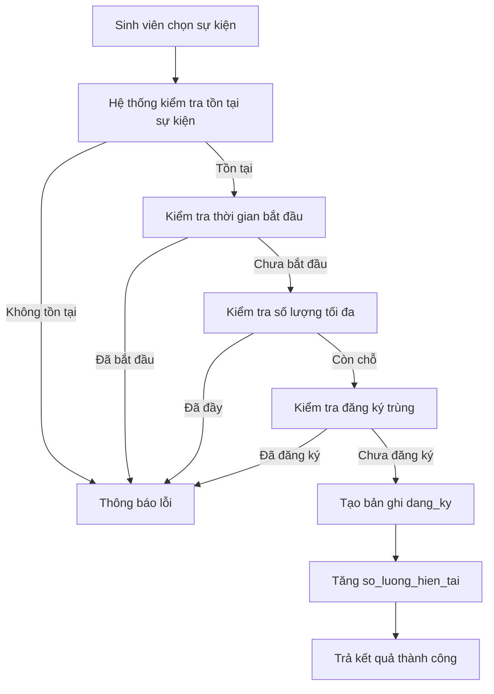
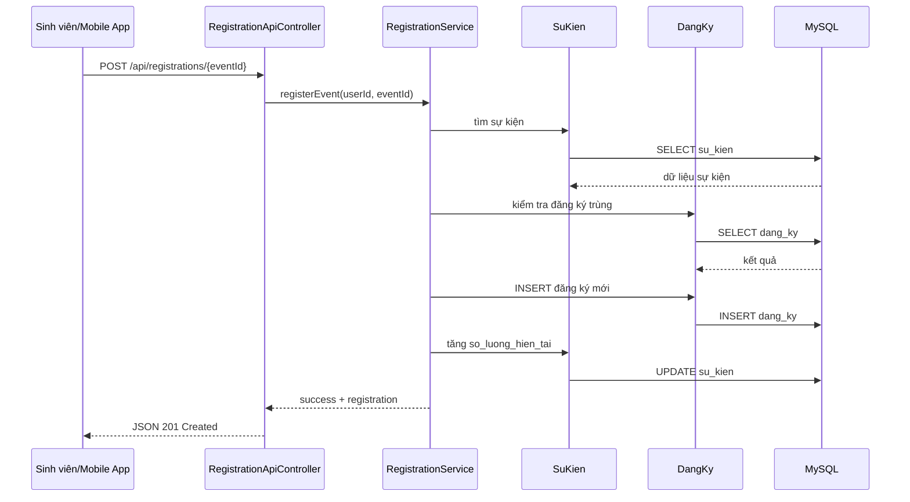
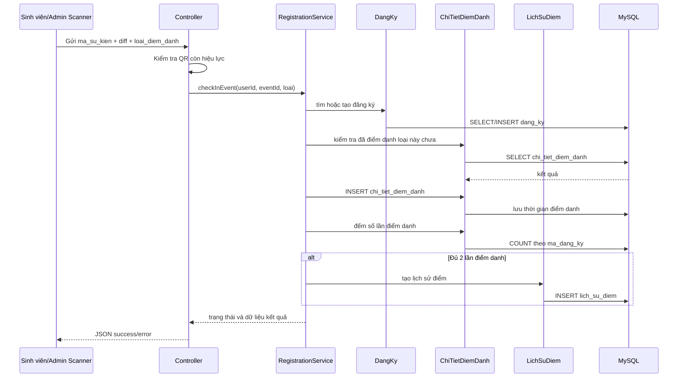
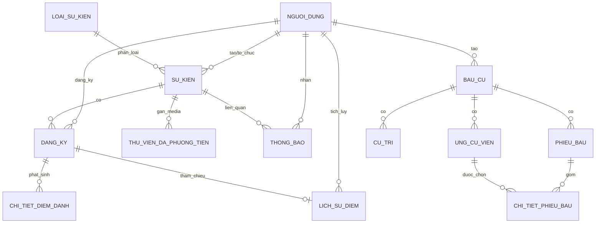
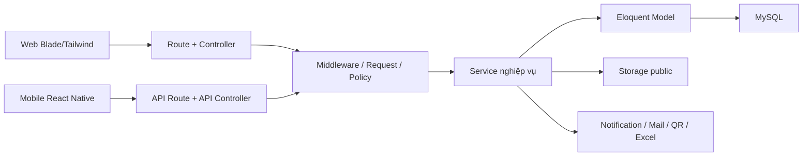

# CHƯƠNG 4. PHÂN TÍCH THIẾT KẾ ỨNG DỤNG

Chương này trình bày kết quả phân tích và thiết kế ứng dụng quản lý sự kiện dựa trên tài liệu đồ án hiện có và hiện trạng mã nguồn của dự án `ql_su_kien`. Khác với phần cơ sở lý thuyết ở Chương 2 và phần khảo sát hiện trạng ở Chương 3, nội dung của chương này đi sâu vào cách hệ thống được mô hình hóa thành các tác nhân, ca sử dụng, lớp nghiệp vụ, mô hình dữ liệu và cấu trúc giao diện. Phân tích được thực hiện bám sát phiên bản triển khai thực tế của hệ thống Laravel, REST API và ứng dụng di động React Native hiện có trong thư mục dự án.

Trong phạm vi triển khai hiện tại, hệ thống hiện thực hai vai trò chính là `admin` và `sinh_vien`. Vai trò giảng viên trong định hướng ban đầu của đề tài có thể được ánh xạ vào nhóm ban tổ chức hoặc nhóm quản trị khi được cấp quyền phù hợp. Bên cạnh giao diện web, hệ thống còn cung cấp API bảo vệ bởi Sanctum để phục vụ ứng dụng di động, đồng thời mở rộng sang các nghiệp vụ đặc thù như điểm danh QR hai bước, quản lý điểm tích lũy, thông báo, bầu cử trực tuyến và nhật ký hoạt động quản trị.

## 4.1 Danh mục use case và các luồng nghiệp vụ chính

### 4.1.1 Tác nhân của hệ thống

Hệ thống có ba nhóm tác nhân chính:

- **Sinh viên**: xem danh sách sự kiện, xem chi tiết, đăng ký/hủy đăng ký, quét QR điểm danh, xem lịch sử tham gia, theo dõi thông báo, tra cứu điểm và tham gia bầu cử.
- **Quản trị viên/Ban tổ chức**: quản lý người dùng, tạo và cập nhật sự kiện, quản lý loại sự kiện, kiểm tra trùng lịch, phát sinh mã QR, điểm danh cho sinh viên, quản lý media, gửi thông báo, xuất báo cáo, theo dõi thống kê và vận hành bầu cử.
- **Ứng dụng di động/Hệ thống ngoài**: truy cập các API đã chuẩn hóa để đăng nhập, lấy danh sách sự kiện, kiểm tra trạng thái đăng ký, đồng bộ quét QR và hiển thị thông tin cá nhân.

### 4.1.2 Danh mục use case chính

| STT | Use case | Tác nhân chính | Mô tả ngắn |
| --- | --- | --- | --- |
| 1 | Đăng nhập/đăng xuất | Sinh viên, Admin | Xác thực người dùng qua web hoặc API, phân quyền theo vai trò |
| 2 | Quản lý hồ sơ cá nhân | Sinh viên | Cập nhật thông tin cá nhân, đổi mật khẩu, xem thông tin tích lũy |
| 3 | Xem danh sách sự kiện | Sinh viên, khách, mobile app | Tìm kiếm, lọc theo loại và trạng thái, phân trang |
| 4 | Xem chi tiết sự kiện | Sinh viên | Xem mô tả, thời gian, địa điểm, hình ảnh, điểm cộng và trạng thái đăng ký |
| 5 | Tạo/cập nhật/xóa sự kiện | Admin | Quản lý nội dung, thời gian, địa điểm, sức chứa, ảnh đại diện, thư viện ảnh |
| 6 | Kiểm tra trùng lịch | Admin | Phát hiện sự kiện giao nhau về thời gian và địa điểm trước khi lưu |
| 7 | Đăng ký tham gia sự kiện | Sinh viên | Ghi nhận đăng ký, chống trùng, kiểm tra còn chỗ và thời gian hợp lệ |
| 8 | Hủy đăng ký sự kiện | Sinh viên | Chỉ cho phép hủy trước thời điểm sự kiện bắt đầu |
| 9 | Điểm danh QR | Sinh viên, Admin | Quét mã QR đầu buổi/cuối buổi, lưu dấu thời gian, cập nhật trạng thái tham gia |
| 10 | Cộng/trừ điểm và xếp hạng | Admin, Hệ thống | Ghi lịch sử điểm khi đủ điều kiện tham gia hoặc khi admin điều chỉnh thủ công |
| 11 | Quản lý thông báo | Sinh viên, Admin | Tạo thông báo hàng loạt, đánh dấu đã đọc, xóa thông báo |
| 12 | Quản lý media | Admin | Upload ảnh/video/tài liệu và gắn vào sự kiện |
| 13 | Quản lý bầu cử | Admin, Sinh viên | Tạo cuộc bầu cử, quản lý ứng cử viên, cử tri, phiếu bầu và xem kết quả |
| 14 | Thống kê và báo cáo | Admin | Xem dashboard, top sự kiện, tổng hợp điểm, xuất báo cáo Excel |
| 15 | Ghi log hoạt động | Hệ thống, Admin | Ghi nhận thao tác tạo, sửa, xóa để kiểm tra và truy vết |

### 4.1.3 Phân tích luồng nghiệp vụ cốt lõi

#### a) Luồng tạo sự kiện

Admin nhập thông tin sự kiện gồm tên, loại sự kiện, thời gian bắt đầu, thời gian kết thúc, địa điểm, số lượng tối đa, điểm cộng và nội dung mô tả. Trước khi lưu, hệ thống có thể gọi chức năng kiểm tra trùng lịch để phát hiện xung đột về thời gian và địa điểm. Khi dữ liệu hợp lệ, hệ thống ghi bản ghi vào bảng `su_kien`, xử lý ảnh đại diện, đồng thời có thể gắn thêm ảnh thư viện vào album của sự kiện. Sau khi tạo thành công, hệ thống phát sinh thông báo hàng loạt tới sinh viên đang hoạt động.

#### b) Luồng đăng ký tham gia sự kiện

Sinh viên truy cập trang chi tiết sự kiện hoặc gọi API tương ứng. Hệ thống lần lượt kiểm tra các điều kiện: sự kiện có tồn tại hay không, sự kiện đã bắt đầu chưa, số lượng tối đa đã đầy chưa, người dùng đã đăng ký trước đó chưa. Nếu thỏa điều kiện, hệ thống tạo bản ghi trong bảng `dang_ky` với trạng thái `da_dang_ky`, sau đó tăng trường `so_luong_hien_tai` trong bảng `su_kien`.

#### c) Luồng điểm danh QR

Điểm danh QR là một trong những nghiệp vụ nổi bật nhất của hệ thống. Phiên bản hiện tại hỗ trợ hai cơ chế:

- **Admin hiển thị QR để sinh viên quét**: ứng dụng hoặc giao diện quét nhận được `ma_su_kien`, thời điểm sinh mã và loại hành động.
- **Admin quét mã sinh viên**: quản trị viên sử dụng màn hình scanner của trang quản trị để ghi nhận điểm danh cho sinh viên theo `mssv`.

Hệ thống kiểm tra mã QR còn hiệu lực thông qua chênh lệch thời gian (`diff`) nhằm giảm nguy cơ dùng lại mã cũ. Mỗi đăng ký có thể phát sinh hai bản ghi điểm danh là `dau_buoi` và `cuoi_buoi` trong bảng `chi_tiet_diem_danh`. Khi sinh viên đã đủ hai lần điểm danh, hệ thống tự động tạo bản ghi điểm trong `lich_su_diem`. Nếu sự kiện kết thúc nhưng người tham gia chỉ mới điểm danh một phần, trạng thái đăng ký được chuyển sang `chua_du_dieu_kien`.

#### d) Luồng quản lý điểm và xếp hạng

Điểm được tích lũy qua hai nguồn chính: tự động từ việc tham gia sự kiện và thủ công từ thao tác cộng/trừ điểm của admin. Mỗi thay đổi được lưu thành một dòng lịch sử trong bảng `lich_su_diem`, giúp truy vết được thời điểm, nguồn gốc và đăng ký liên quan. Tổng điểm của mỗi sinh viên được tính bằng tổng đại số của toàn bộ bản ghi lịch sử.

#### e) Luồng thông báo

Thông báo hiện được thiết kế theo hướng lưu bền vững trong cơ sở dữ liệu thông qua bảng `thong_bao`. Khi có sự kiện mới, thay đổi thông tin quan trọng hoặc cập nhật điểm, hệ thống sẽ tạo thông báo theo từng người dùng hoặc hàng loạt. Người dùng có thể xem danh sách, lọc thông báo chưa đọc, đánh dấu đã đọc hoặc xóa thông báo. Thiết kế này bảo đảm người dùng không bỏ lỡ thông tin ngay cả khi không trực tuyến tại thời điểm phát sinh.

#### f) Luồng bầu cử trực tuyến

Admin tạo cuộc bầu cử, thêm ứng cử viên và cử tri đủ điều kiện. Khi thời gian bầu cử bắt đầu, sinh viên trong danh sách cử tri có thể bỏ phiếu theo số lượng lựa chọn tối thiểu và tối đa được cấu hình. Dữ liệu phiếu bầu được lưu tách thành bảng phiếu tổng (`phieu_bau`) và bảng chi tiết phiếu (`chi_tiet_phieu_bau`) để vừa bảo toàn lịch sử, vừa thuận tiện cho thống kê kết quả. Kết quả có thể được xem trên web qua API tổng hợp số phiếu theo từng ứng cử viên.

## 4.2 Biểu đồ hoạt động và sequence cho các luồng chính

### 4.2.1 Biểu đồ hoạt động của nghiệp vụ đăng ký sự kiện



Biểu đồ trên thể hiện tư duy thiết kế "kiểm tra điều kiện trước, ghi dữ liệu sau". Mỗi điều kiện thất bại sẽ dừng luồng và trả lỗi sớm, giúp hệ thống tránh phát sinh bản ghi không hợp lệ.

### 4.2.2 Sequence diagram cho luồng đăng ký qua API



Sequence này cho thấy controller chỉ làm nhiệm vụ tiếp nhận request và trả response, trong khi toàn bộ quy tắc nghiệp vụ được gom vào lớp `RegistrationService`. Đây là điểm thiết kế quan trọng nhằm giảm trùng lặp logic giữa web và API.

### 4.2.3 Sequence diagram cho luồng điểm danh QR hai bước



Thiết kế này cho phép một đăng ký được quản lý theo mức chi tiết hơn thay vì chỉ có trạng thái "đã tham gia" hay "vắng mặt". Nhờ bảng `chi_tiet_diem_danh`, hệ thống theo dõi được cả đầu buổi, cuối buổi và đủ điều kiện nhận điểm hay chưa.

## 4.3 Mô hình dữ liệu và thiết kế cơ sở dữ liệu

### 4.3.1 Các nhóm thực thể chính

Mô hình dữ liệu của hệ thống được chia thành bốn nhóm nghiệp vụ:

- **Nhóm tài khoản và phân quyền**: `nguoi_dung`, `personal_access_tokens`, `password_reset_tokens`.
- **Nhóm quản lý sự kiện**: `loai_su_kien`, `su_kien`, `dang_ky`, `chi_tiet_diem_danh`, `lich_su_diem`, `thu_vien_da_phuong_tien`, `thong_bao`.
- **Nhóm bầu cử trực tuyến**: `bau_cu`, `ung_cu_vien`, `cu_tri`, `phieu_bau`, `chi_tiet_phieu_bau`.
- **Nhóm cấu hình và giám sát**: `smtp_settings`, `activity_logs`.

Trong đó, các bảng lõi nhất đối với bài toán quản lý sự kiện là `nguoi_dung`, `su_kien`, `dang_ky`, `chi_tiet_diem_danh`, `lich_su_diem` và `thong_bao`.

### 4.3.2 Thiết kế quan hệ thực thể



### 4.3.3 Thiết kế bảng lõi

#### a) Bảng `nguoi_dung`

Đây là bảng gốc lưu thông tin định danh người dùng. Điểm đáng chú ý trong thiết kế hiện tại là hệ thống sử dụng trực tiếp `ma_sinh_vien` làm khóa chính thay vì dùng khóa số nguyên tự tăng. Quyết định này làm đơn giản hóa việc hiển thị, tìm kiếm và điểm danh bằng mã sinh viên.

Các thuộc tính quan trọng:

- `ma_sinh_vien`: khóa chính, độ dài 8 ký tự, có ràng buộc kiểm tra định dạng số.
- `vai_tro`: phân biệt `admin` và `sinh_vien`.
- `lop`: hỗ trợ thống kê theo lớp.
- `email_verified_at`: phục vụ xác thực email trước khi dùng API mobile.
- `trang_thai`: phản ánh trạng thái hoạt động của tài khoản.

#### b) Bảng `su_kien`

Đây là bảng trung tâm của toàn hệ thống. Mỗi sự kiện gắn với một loại sự kiện, người tạo, người tổ chức, số lượng tham gia, điểm cộng và trạng thái vòng đời.

Các điểm thiết kế nổi bật:

- Trạng thái nghiệp vụ được mã hóa bằng enum: `sap_to_chuc`, `dang_dien_ra`, `da_ket_thuc`, `huy`.
- Có `so_luong_toi_da` và `so_luong_hien_tai` để kiểm soát sức chứa.
- Có `qr_checkin_token` và `qr_code_path` để phục vụ điểm danh bằng QR.
- Có trường `bo_cuc` kiểu JSON/array để lưu cấu hình bố cục hiển thị của trang chi tiết sự kiện.
- Sử dụng `softDeletes` để tránh mất dữ liệu nghiệp vụ khi xóa sự kiện.

#### c) Bảng `dang_ky`

`dang_ky` là bảng liên kết nhiều-nhiều giữa người dùng và sự kiện, đồng thời lưu trạng thái tham gia. Đây không chỉ là bảng liên kết đơn thuần mà còn là thực thể nghiệp vụ quan trọng để suy ra điểm danh, cộng điểm và thống kê.

Các ràng buộc chính:

- Khóa duy nhất `unique(ma_sinh_vien, ma_su_kien)` chống đăng ký trùng.
- Trạng thái tham gia gồm `da_dang_ky`, `da_tham_gia`, `vang_mat`, `chua_du_dieu_kien`, `huy`.
- Dùng soft delete để hỗ trợ hủy đăng ký mà vẫn bảo toàn lịch sử logic.

#### d) Bảng `chi_tiet_diem_danh`

Đây là bảng mở rộng mới giúp mô hình hóa chi tiết quá trình tham gia. Mỗi bản ghi biểu diễn một lần điểm danh hợp lệ của sinh viên trong một sự kiện.

Thiết kế của bảng này giải quyết ba bài toán:

- Phân biệt điểm danh đầu buổi và cuối buổi.
- Chống quét trùng nhờ ràng buộc duy nhất `unique(ma_dang_ky, loai_diem_danh)`.
- Làm cơ sở để xác định người học đã đủ điều kiện nhận điểm hay chưa.

#### e) Bảng `lich_su_diem`

Thay vì lưu tổng điểm trực tiếp tại bảng người dùng, hệ thống lưu từng giao dịch điểm vào `lich_su_diem`. Cách tiếp cận này gần với mô hình sổ cái, vừa minh bạch vừa dễ mở rộng.

Ưu điểm của thiết kế:

- Truy vết được nguồn gốc điểm cộng/trừ.
- Dễ tính tổng điểm, bảng xếp hạng hoặc thống kê theo khoảng thời gian.
- Liên kết được với `ma_dang_ky` để biết điểm phát sinh từ sự kiện nào.

#### f) Bảng `thong_bao`

Mỗi thông báo gắn với một người dùng và có thể tham chiếu tới một sự kiện liên quan. Bảng có cặp chỉ mục `(ma_sinh_vien, da_doc)` để tối ưu truy vấn thông báo chưa đọc, phù hợp với nhu cầu hiển thị badge số lượng trên giao diện web và mobile.

#### g) Bảng `thu_vien_da_phuong_tien`

Bảng này lưu các tệp ảnh, video và tài liệu. Thiết kế cho phép một tệp vừa gắn với một sự kiện cụ thể, vừa có thể đóng vai trò tài nguyên dùng lại trong thư viện. Thuộc tính `la_cong_khai` giúp tách biệt dữ liệu công khai và dữ liệu dùng nội bộ.

### 4.3.4 Ràng buộc toàn vẹn và tối ưu truy vấn

Hệ thống sử dụng kết hợp khóa ngoại, chỉ mục và enum để bảo đảm tính toàn vẹn dữ liệu:

- Các bảng lõi đều có khóa ngoại rõ ràng đến `nguoi_dung`, `su_kien`, `bau_cu`.
- `su_kien` có chỉ mục trên `thoi_gian_bat_dau`, `thoi_gian_ket_thuc` và `trang_thai` để tăng tốc lọc theo thời gian và trạng thái.
- `thong_bao` có chỉ mục kép `(ma_sinh_vien, da_doc)` để hỗ trợ lấy thông báo chưa đọc.
- `chi_tiet_diem_danh` có chỉ mục trên `ma_dang_ky`, `ma_su_kien`, `ma_sinh_vien` và chỉ mục ghép với `loai_diem_danh`.
- `activity_logs` có chỉ mục theo `user_id`, `action`, `created_at` và cặp `(model_type, model_id)` để hỗ trợ truy vết.

Nhìn tổng thể, mô hình dữ liệu của hệ thống đã tách được các thực thể độc lập, hạn chế dư thừa và đủ linh hoạt để mở rộng thêm mobile app, chatbot hay báo cáo thời gian thực ở các giai đoạn sau.

## 4.4 Thiết kế kiến trúc ứng dụng

### 4.4.1 Kiến trúc phân lớp

Từ góc nhìn triển khai thực tế, hệ thống được tổ chức theo kiến trúc phân lớp gồm bốn lớp chính:

1. **Presentation Layer**
   Bao gồm giao diện Blade + Tailwind ở web, giao diện React Native ở mobile và các route định tuyến trong `routes/web.php`, `routes/api.php`.

2. **Application Layer**
   Bao gồm các controller, form request, middleware, policy và command. Lớp này tiếp nhận request, xác thực dữ liệu đầu vào, điều phối service và quyết định response.

3. **Domain/Business Layer**
   Bao gồm các lớp service như `EventService`, `RegistrationService`, `NotificationService`, `PointService`, `QrCheckinService`. Đây là nơi tập trung quy tắc nghiệp vụ quan trọng như chống đăng ký trùng, kiểm tra điều kiện điểm danh, cộng điểm sau hai lần check-in hoặc gửi thông báo hàng loạt.

4. **Data Layer**
   Bao gồm Eloquent model, migration, seeder, MySQL và hệ thống lưu trữ file trên disk `public`.

Sơ đồ khái quát:



Thiết kế phân lớp này giúp controller mỏng, nghiệp vụ tập trung và dễ dùng lại giữa web với API. Đây là một điểm phù hợp với đồ án tốt nghiệp vì thể hiện rõ tư duy tổ chức hệ thống, không chỉ dừng ở mức "viết chức năng chạy được".

### 4.4.2 Kiến trúc MVC trong Laravel

Framework Laravel được sử dụng như bộ khung triển khai chính cho ứng dụng web:

- **Model**: đại diện cho dữ liệu như `User`, `SuKien`, `DangKy`, `ThongBao`, `BauCu`.
- **View**: các file Blade trong `resources/views`, chia thành khu vực công khai, khu vực người dùng và khu vực quản trị.
- **Controller**: các controller web và API tiếp nhận yêu cầu từ route, gọi model hoặc service rồi trả về view hoặc JSON.

Mặc dù nền tảng là MVC, mã nguồn đã được cải tiến theo hướng tách thêm lớp service để tránh việc controller chứa quá nhiều nghiệp vụ. Do đó có thể xem kiến trúc hiện tại là MVC mở rộng theo phong cách service-oriented.

### 4.4.3 Thiết kế API và chuẩn JSON response

Nhóm API trong `routes/api.php` được thiết kế phục vụ chủ yếu cho mobile app và các tác vụ tích hợp. Các endpoint được phân thành ba mức:

- Public API: đăng nhập, lấy danh sách sự kiện, xem chi tiết sự kiện, lấy loại sự kiện.
- Protected API: hồ sơ cá nhân, đăng ký sự kiện, lịch sử tham gia, thông báo, điểm.
- Admin API: CRUD sự kiện, người dùng, quản lý đăng ký, thống kê, media.

Mẫu response JSON được chuẩn hóa tương đối thống nhất:

```json
{
  "success": true,
  "message": "Mô tả ngắn",
  "data": {},
  "pagination": {}
}
```

Các mã lỗi sử dụng trong hệ thống:

- `200 OK`: lấy dữ liệu hoặc cập nhật thành công.
- `201 Created`: tạo mới thành công như đăng ký sự kiện hoặc thêm điểm.
- `400 Bad Request`: vi phạm điều kiện nghiệp vụ như đăng ký trùng, QR hết hạn, đã điểm danh trước đó.
- `401 Unauthorized`: sai thông tin đăng nhập.
- `403 Forbidden`: chưa xác thực email, tài khoản bị khóa hoặc không đủ quyền.
- `404 Not Found`: không tìm thấy sự kiện, người dùng hoặc thông báo.
- `500 Internal Server Error`: lỗi máy chủ hoặc ngoại lệ chưa xử lý chi tiết.

### 4.4.4 Tích hợp web và mobile

Thiết kế hiện tại cho thấy hệ thống không chỉ là một website đơn lẻ. Web và mobile chia sẻ cùng một lõi nghiệp vụ ở backend:

- Web dùng session và Blade để phục vụ người dùng trình duyệt.
- Mobile dùng Sanctum token để xác thực, gọi các API JSON.
- Cùng thao tác trên một cơ sở dữ liệu và các bảng nghiệp vụ dùng chung.
- Mobile có thêm cơ chế hàng chờ offline cho tác vụ quét QR, giúp tăng tính thực tiễn khi tổ chức sự kiện tại nơi mạng yếu.

Nhờ thiết kế này, hệ thống đạt được khả năng mở rộng đa kênh nhưng vẫn tránh nhân đôi logic nghiệp vụ.

## 4.5 Phân quyền và bảo mật

### 4.5.1 Cơ chế xác thực

Hệ thống sử dụng hai cơ chế xác thực song song:

- **Web authentication**: xác thực phiên đăng nhập qua session, kèm các chức năng quên mật khẩu, đặt lại mật khẩu và xác minh email.
- **API authentication**: dùng `Laravel Sanctum` để cấp token cho ứng dụng mobile.

Ở phía API, ngoài việc kiểm tra email và mật khẩu, hệ thống còn kiểm tra:

- Email đã xác minh chưa.
- Tài khoản có đang ở trạng thái `hoat_dong` hay không.

Thiết kế này đặc biệt quan trọng với mobile app, vì token chỉ được cấp cho tài khoản hợp lệ và đã được xác minh.

### 4.5.2 Phân quyền theo vai trò

Phân quyền được triển khai theo nhiều tầng:

- `auth` và `auth:sanctum`: buộc người dùng phải đăng nhập.
- `role:admin`: chỉ cho phép admin vào khu vực quản trị hoặc gọi admin API.
- Policy như `EventPolicy`, `UserPolicy`: kiểm tra hành vi cụ thể như tạo, sửa, xóa.

Việc kết hợp middleware với policy tạo nên mô hình kiểm soát truy cập hai lớp:

- Lớp 1 kiểm tra người dùng thuộc nhóm nào.
- Lớp 2 kiểm tra người dùng đó có được thao tác trên tài nguyên cụ thể hay không.

### 4.5.3 Bảo vệ dữ liệu và tài nguyên

Các biện pháp bảo vệ dữ liệu đang hoặc nên được áp dụng trong thiết kế gồm:

- Mật khẩu được băm trước khi lưu.
- Token API được quản lý qua Sanctum.
- Web có CSRF token trong layout để chống giả mạo yêu cầu.
- Media được lưu trong `storage/public`, chỉ liên kết đến giao diện khi cần hiển thị.
- Tài khoản có trạng thái khóa/mở để vô hiệu hóa truy cập.
- Kiểm tra định dạng `mssv` bằng cả ràng buộc cơ sở dữ liệu lẫn validation ở controller/request.

### 4.5.4 Kiểm toán và truy vết hoạt động

Một điểm mạnh trong thiết kế hiện tại là có cơ chế ghi nhật ký hoạt động thông qua bảng `activity_logs` và trait `LogsActivity`. Khi admin tạo, sửa hoặc xóa các bản ghi quan trọng như sự kiện hoặc bầu cử, hệ thống sẽ tự động lưu:

- người thực hiện,
- hành động,
- mô tả,
- mô hình tác động,
- địa chỉ IP,
- trình duyệt,
- dữ liệu cũ và mới nếu có.

Thiết kế này vừa giúp hỗ trợ quản trị, vừa tăng độ tin cậy khi hệ thống được đưa vào sử dụng thực tế.

## 4.6 Thiết kế giao diện và trải nghiệm người dùng

### 4.6.1 Sơ đồ chức năng giao diện

#### a) Khu vực người dùng web

```text
Đăng nhập/Đăng ký
  -> Trang chủ
  -> Danh sách sự kiện
  -> Chi tiết sự kiện
  -> Lịch sử tham gia
  -> Quét QR
  -> Thông báo
  -> Hồ sơ cá nhân
  -> Bầu cử / Bỏ phiếu / Kết quả
```

#### b) Khu vực quản trị

```text
Dashboard
  -> Quản lý sự kiện
  -> Quản lý người dùng
  -> Thư viện media
  -> Templates
  -> Bầu cử
  -> Báo cáo
  -> Thống kê
  -> QR sự kiện
  -> Quét QR người dùng
  -> SMTP
  -> Log hoạt động
```

#### c) Ứng dụng di động

```text
Đăng nhập
  -> Tab Sự kiện
  -> Tab Thông báo
  -> Tab Cá nhân
  -> Chi tiết sự kiện
  -> Quét QR
```

### 4.6.2 Nguyên tắc thiết kế giao diện

Từ cấu trúc Blade và mobile app hiện có, có thể rút ra các nguyên tắc thiết kế giao diện như sau:

- Giao diện chia rõ hai ngữ cảnh sử dụng: người dùng cuối và quản trị viên.
- Danh sách sự kiện được ưu tiên hiển thị theo card, dễ quét nhanh bằng mắt.
- Trạng thái sự kiện được gắn badge màu (`sap_to_chuc`, `dang_dien_ra`, `da_ket_thuc`, `huy`) để giảm tải nhận thức.
- Các trang danh sách đều hỗ trợ tìm kiếm, lọc và phân trang.
- Luồng quét QR được rút gọn thao tác, phù hợp sử dụng một tay trên điện thoại.
- Khu vực quản trị ưu tiên dạng dashboard và sidebar để thao tác nhanh khi vận hành sự kiện.

### 4.6.3 Thiết kế UX cho nghiệp vụ điểm danh QR

Điểm danh là luồng đòi hỏi tốc độ thao tác cao. Vì vậy, thiết kế UX của hệ thống đi theo các nguyên tắc:

- Màn hình scanner toàn màn hình, vùng quét rõ ràng.
- Phản hồi tức thời sau khi quét thành công hoặc thất bại.
- Kiểm soát quét lặp bằng cờ trạng thái `scanned`.
- Tách thông điệp thành công và lỗi bằng màu sắc rõ ràng.
- Ở mobile, hỗ trợ hàng chờ offline để không gián đoạn quy trình tổ chức sự kiện.

### 4.6.4 Thiết kế UX cho thông báo và trạng thái hệ thống

Thông báo được hiển thị theo cả hai mức:

- Badge số lượng chưa đọc trên thanh điều hướng.
- Danh sách chi tiết trong trang thông báo hoặc tab mobile.

Về mặt UX, thiết kế này phù hợp với đặc thù người dùng sinh viên: cần nhìn thấy ngay có thay đổi mới, nhưng vẫn có nơi tra cứu lịch sử đầy đủ. Với bầu cử, hệ thống cung cấp API trả kết quả hiện thời để giao diện có thể cập nhật định kỳ mà không bắt người dùng tải lại trang thủ công.

## 4.7 Thiết kế hiệu năng và khả năng mở rộng

### 4.7.1 Tối ưu truy vấn dữ liệu

Mã nguồn hiện tại đã thể hiện một số quyết định tối ưu rõ ràng:

- Dùng `paginate()` cho danh sách sự kiện, đăng ký, điểm và thông báo.
- Dùng eager loading như `with('loaiSuKien')`, `with(['loaiSuKien', 'media', 'nguoiTao'])`, `with(['nguoiDung', 'suKien'])` để giảm truy vấn lặp.
- Sử dụng chỉ mục ở các bảng hay truy vấn lọc theo trạng thái, thời gian, người dùng.
- Tách bảng `chi_tiet_diem_danh` khỏi `dang_ky` để truy vấn theo loại điểm danh rõ ràng hơn.

Các kỹ thuật này giúp hạn chế hiện tượng N+1 query và bảo đảm hệ thống vẫn đáp ứng được khi số lượng sự kiện hoặc người tham gia tăng lên.

### 4.7.2 Chiến lược phân trang và hiển thị

Phân trang được áp dụng ở cả web và API:

- Web sự kiện dùng 8 hoặc 10 bản ghi mỗi trang.
- API hỗ trợ tham số `page` và `limit`.
- Mobile sử dụng infinite scroll để giảm tải ban đầu và tăng trải nghiệm trên màn hình nhỏ.

Thiết kế này giúp cân bằng giữa tốc độ tải trang, chi phí truy vấn và trải nghiệm người dùng.

### 4.7.3 Thiết kế hỗ trợ thời gian thực

Hệ thống đã chuẩn bị cấu hình `broadcasting.php`, Redis trong `docker-compose.yml` và cấu trúc frontend cho Echo/Pusher. Tuy nhiên, ở phiên bản mã nguồn hiện tại, phần Echo phía client vẫn đang để ở trạng thái dự phòng. Điều này cho thấy hướng thiết kế là hỗ trợ thời gian thực, nhưng phần triển khai thực tế đang ưu tiên tính ổn định bằng:

- thông báo lưu bền trong cơ sở dữ liệu,
- API polling cho kết quả bầu cử,
- đồng bộ mobile theo lô với hàng chờ offline.

Đây là một quyết định thiết kế hợp lý trong bối cảnh đồ án, vì giúp hệ thống hoạt động ổn định trước khi mở rộng sang WebSocket thời gian thực hoàn chỉnh.

### 4.7.4 Caching, queue và rate limiting

Về mặt thiết kế tổng thể, hệ thống có các điểm sẵn sàng cho mở rộng hiệu năng:

- Redis đã được khai báo như một service độc lập, có thể dùng cho cache, queue và broadcasting.
- Các tác vụ như gửi email, gửi thông báo hàng loạt hoặc đồng bộ trạng thái sự kiện có thể chuyển sang hàng đợi để tránh chặn request.
- Với API mobile, đặc biệt là nhóm đăng nhập và quét QR, nên áp dụng thêm `throttle` theo người dùng hoặc theo IP để hạn chế spam và giảm nguy cơ brute-force.

Hiện tại, các tối ưu đã hiện thực rõ nhất là phân trang, chỉ mục, eager loading và tách service. Các kỹ thuật cache và rate limit nâng cao là hướng mở rộng tự nhiên ở giai đoạn tiếp theo.

### 4.7.5 Khả năng triển khai và mở rộng

Thiết kế triển khai với Docker Compose cho thấy hệ thống đã được chuẩn bị theo hướng môi trường chuẩn hóa. Các thành phần `app`, `db`, `nginx`, `redis` được tách riêng, nhờ đó:

- dễ cài đặt trên nhiều máy khác nhau,
- giảm sai lệch môi trường phát triển,
- thuận tiện khi mở rộng từng lớp độc lập.

Từ nền tảng này, hệ thống có thể mở rộng theo các hướng:

- triển khai WebSocket thực thụ cho thông báo và kết quả bầu cử,
- mở rộng ứng dụng mobile đầy đủ cho admin,
- tích hợp chatbot tư vấn đúng như định hướng ban đầu của đề tài,
- bổ sung dashboard phân tích sâu hơn theo lớp, theo loại sự kiện và theo học kỳ.

## Kết luận chương

Kết quả phân tích và thiết kế cho thấy hệ thống quản lý sự kiện được xây dựng với cấu trúc tương đối hoàn chỉnh, có định hướng mở rộng rõ ràng và bám sát nghiệp vụ thực tế của Khoa Công nghệ Thông tin. Điểm nổi bật của thiết kế là việc kết hợp quản lý sự kiện truyền thống với các chức năng nâng cao như điểm danh QR hai bước, lịch sử điểm, thông báo, bầu cử trực tuyến, ứng dụng di động và nhật ký hoạt động quản trị.

Về kỹ thuật, hệ thống thể hiện được tư duy phân lớp rõ ràng, dữ liệu được chuẩn hóa, API được chuẩn hóa ở mức thực dụng, còn giao diện được tách riêng theo ngữ cảnh người dùng và quản trị. Đây là cơ sở quan trọng để chuyển sang Chương 5, nơi trình bày quá trình xây dựng, hiện thực và kiểm thử các module đã được thiết kế trong chương này.
